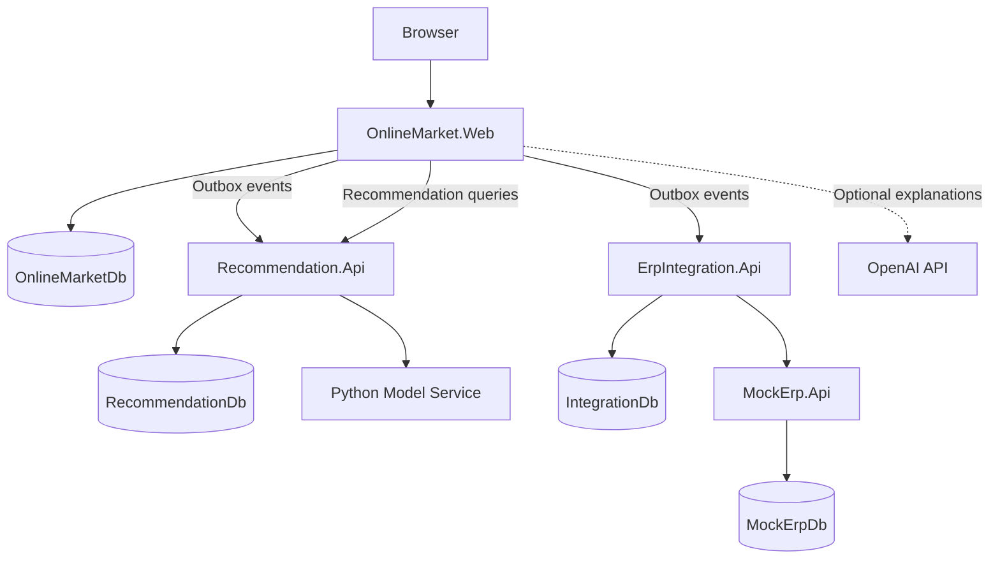

# Online Market — Recommendation and ERP Integration System

[](https://dotnet.microsoft.com/)
[](https://www.python.org/)
[](https://www.microsoft.com/sql-server)
[](https://www.docker.com/)
[](#testing)

An end-to-end online grocery platform that combines a full ASP.NET Core storefront, a hybrid recommendation engine, and a resilient ERP integration workflow.

The system generates personalized, similar-product, frequently-bought-together, popular, and cart-completion recommendations from shopping behavior. Confirmed orders are transferred to a simulated ERP through a durable four-step workflow that creates the customer, order, stock movement, and accounting entry without losing the original market order when downstream services are unavailable.

> This repository was developed as a three-person Uyumsoft internship project. `MockErp.Api` simulates ERP behavior and does **not** connect to a real Uyumsoft ERP installation.

[Repository](https://github.com/keremy321/OnlineMarket)

## Why this project is more than a storefront

- **Hybrid recommendations:** SQL-based popularity, association rules, and cart completion are combined with TF-IDF content similarity and implicit ALS collaborative filtering.
- **Reliable order delivery:** a Transactional Outbox stores each integration event in the same transaction as the order, then delivers it asynchronously.
- **Resilient ERP orchestration:** durable step state, exponential backoff, circuit breaking, lock recovery, manual retry, and deterministic idempotency prevent lost or duplicated work.
- **Clear service ownership:** each deployable service owns its database; no service shares a `DbContext`, performs cross-database joins, or reads another service's tables.
- **Privacy-aware AI:** customer identifiers are pseudonymized before reaching the Python model service. The optional OpenAI integration explains results but never chooses or ranks products.
- **Production-minded verification:** the solution includes 469 .NET tests, 70 Python tests, Testcontainers-based SQL Server integration tests, strict validation, API-key authentication, and package vulnerability auditing.

## Core capabilities

### Storefront and administration

- Registration, sign-in, sign-out, and role-based access with ASP.NET Core Identity
- Category, brand, product, search, filter, sorting, and product-detail experiences
- Shopping cart, address selection, VAT-aware checkout, payment simulation, and atomic stock updates
- Order history and ERP transfer status
- Admin product and stock management, Outbox monitoring, manual processing, and image matching
- Server-side validation of recommended products before display, including active-status and stock checks

### Recommendation system

| Recommendation | Method | Main surface |
|---|---|---|
| Popular products | Recency-weighted sales and order counts | Home page |
| Personalized | Hybrid implicit ALS, behavioral signals, and popularity fallback | Home page |
| Frequently bought together | Co-occurrence, support, confidence, and lift | Product details |
| Cart completion | Association strength across current cart items | Home page and cart |
| Similar products | TF-IDF content similarity | Product details |

The recommendation platform is event-fed: product and confirmed-order Outbox events become local snapshots in `RecommendationDb`. Model recalculation is explicit, artifacts are persisted, and the API continues serving SQL-based fallbacks if the Python model service is unavailable.

### ERP integration

Each confirmed order creates a durable integration batch with four ordered steps:

1. `EnsureCustomer`
2. `CreateOrder`
3. `CreateStockMovement`
4. `CreateAccountingEntry`

The worker claims runnable steps under SQL locks, reclaims expired locks, records every attempt, classifies transient and permanent failures, retries with exponential backoff, and supports manual recovery. Stable `Idempotency-Key` values prevent duplicate ERP records during retries; reusing a key with a different payload is rejected as a conflict.

### AI support assistant

The storefront includes an optional support widget with deterministic C# intent routing. Product selection always comes from `Recommendation.Api`; an OpenAI-compatible provider may only turn the structured result into a natural-language explanation. Without an API key, the widget remains available and uses deterministic Turkish response templates.

The assistant does not send customer IDs, pseudonymous subject IDs, email addresses, phone numbers, addresses, order payloads, or API keys to the LLM provider.

## Architecture

The solution uses a selective microservice architecture: independently deployable services are separated where data ownership, failure isolation, and integration behavior matter, while the storefront remains a cohesive MVC application.



### Service responsibilities

| Service | Responsibility | Data store |
|---|---|---|
| `OnlineMarket.Web` | MVC storefront, Identity, catalog, cart, checkout, inventory, admin UI, Outbox producer/dispatcher | `OnlineMarketDb` |
| `Recommendation.Api` | Event ingestion, five recommendation APIs, model orchestration, evaluation | `RecommendationDb` |
| `Recommendation.ModelService` | TF-IDF, implicit ALS, hybrid ranking, inference, and offline evaluation | Versioned artifacts |
| `ErpIntegration.Api` | Durable ERP batch/step state machine, retries, status, and adapter | `IntegrationDb` |
| `MockErp.Api` | Idempotent customer, order, stock, and accounting simulation | `MockErpDb` |

### Confirmed-order flow

1. Checkout revalidates products, prices, VAT, address ownership, and stock.
2. The order, address snapshot, line items, payment simulation, stock changes, stock movements, and two Outbox messages commit in one `OnlineMarketDb` transaction.
3. No downstream HTTP request occurs inside the checkout transaction.
4. The Outbox worker delivers the confirmed-order snapshot to `Recommendation.Api` and the ERP event to `ErpIntegration.Api`.
5. The recommendation service updates its local snapshots.
6. The integration worker executes the four ERP steps in order.
7. Retry and idempotency preserve at-least-once delivery without duplicating simulated ERP records.

## Recommendation design and evaluation

### Model components

- **Popularity:** SQL-based weighted ranking over recent confirmed orders
- **Frequently bought together:** directional association rules using support, confidence, and lift
- **Cart completion:** candidate aggregation and weighted affinity across the active cart
- **TF-IDF:** content vectors for product similarity
- **Implicit ALS:** collaborative filtering over pseudonymous customer-product interactions
- **Hybrid ranking:** normalized combination of collaborative, content, and fallback signals

`HmacRecommendationSubjectIdDeriver` converts the market's customer ID into a stable, versioned HMAC-SHA256 `SubjectId`. Only this opaque identifier is shared with the model service.

If interaction data is insufficient, ALS reports `InsufficientData` and the system falls back to TF-IDF and popularity. If the model service is unavailable, a circuit breaker skips model-based calls while SQL-based recommendation paths remain operational.

### Offline results

The committed temporal holdout report was produced from 502 orders, 110 pseudonymous subjects, 205 products, and 1,505 interactions with `K = 5`.

| Model | Precision@5 | Recall@5 | Hit Rate@5 | NDCG@5 | Catalog coverage |
|---|---:|---:|---:|---:|---:|
| Hybrid | **0.1000** | **0.1585** | **0.4000** | **0.1383** | 0.8537 |
| ALS | 0.0873 | 0.1456 | 0.3727 | 0.1266 | **0.8927** |
| Popularity | 0.0018 | 0.0018 | 0.0091 | 0.0019 | 0.0390 |

These metrics describe offline ranking quality for the dated evaluation artifact committed on 5 August 2026. TF-IDF similarity and FBT were not evaluated by this protocol, and the results should be regenerated whenever the dataset or ranking logic changes.

## Technology stack

| Area | Technology |
|---|---|
| Web application | ASP.NET Core MVC, .NET 10, Bootstrap 5, JavaScript |
| APIs | ASP.NET Core Web API, controller-based endpoints, Scalar/OpenAPI |
| Persistence | Entity Framework Core 10, SQL Server 2022 |
| Authentication | ASP.NET Core Identity, role-based authorization, API keys |
| ML service | Python 3.13, FastAPI, scikit-learn, implicit, NumPy, SciPy |
| Reliability | Transactional Outbox, idempotency, retries, circuit breakers, SQL worker locks |
| Testing | xUnit, pytest, Testcontainers for SQL Server, ASP.NET Core integration testing |
| Infrastructure | Docker, Docker Compose, PowerShell automation |
| Optional LLM | OpenAI-compatible Chat Completions API |

## Repository structure

```text
.
├── src/
│   ├── OnlineMarket.Web/
│   ├── Recommendation.Api/
│   ├── Recommendation.ModelService/
│   ├── ErpIntegration.Api/
│   └── MockErp.Api/
├── tests/
├── deploy/
├── scripts/
│   ├── database/
│   └── seed/
└── docs/
```

## Getting started

### Prerequisites

- .NET 10 SDK (`global.json` targets SDK `10.0.300` with feature-band roll-forward)
- Docker Desktop or Docker Engine with Docker Compose v2
- At least 2 GB of memory available to the SQL Server container
- PowerShell 7 or Windows PowerShell 5.1 for the database scripts
- Python 3.13 only when running the model service outside Docker

### 1. Clone and restore

```powershell
git clone https://github.com/keremy321/OnlineMarket.git
cd OnlineMarket
dotnet restore .\OnlineMarket.slnx
dotnet tool restore
Copy-Item .\deploy\.env.example .\deploy\.env
```

Replace the placeholders in `deploy/.env`, then configure local secrets. Never commit credentials.

### 2. Configure required secrets

| Application | Required configuration |
|---|---|
| `OnlineMarket.Web` | `ConnectionStrings:OnlineMarketDb`, `Services:RecommendationOutbox:ApiKey` |
| `Recommendation.Api` | `ConnectionStrings:RecommendationDb`, `Security:ApiKey`, `RecommendationSubject:Key`, model-service address and API key |
| `ErpIntegration.Api` | `ConnectionStrings:IntegrationDb`, `MockErp:BaseAddress`, `MockErp:ApiKey` |
| `MockErp.Api` | `ConnectionStrings:MockErpDb`, `Security:ApiKey` |
| Model service | `RECOMMENDATION_MODEL_API_KEY` |

The following pairs must match:

- Web `Services:RecommendationOutbox:ApiKey` ↔ Recommendation API `Security:ApiKey`
- Integration API `MockErp:ApiKey` ↔ Mock ERP `Security:ApiKey`
- Recommendation API model-service key ↔ `RECOMMENDATION_MODEL_API_KEY`

The OpenAI key is optional. If it is absent, recommendation functionality still works and the assistant uses deterministic response templates.

Example configuration:

```powershell
dotnet user-secrets --project .\src\OnlineMarket.Web set "ConnectionStrings:OnlineMarketDb" "<CONNECTION_STRING>"
dotnet user-secrets --project .\src\OnlineMarket.Web set "Services:RecommendationOutbox:ApiKey" "<RECOMMENDATION_API_KEY>"

dotnet user-secrets --project .\src\Recommendation.Api set "ConnectionStrings:RecommendationDb" "<CONNECTION_STRING>"
dotnet user-secrets --project .\src\Recommendation.Api set "Security:ApiKey" "<RECOMMENDATION_API_KEY>"
dotnet user-secrets --project .\src\Recommendation.Api set "RecommendationSubject:Key" "<MINIMUM_32_BYTE_KEY>"
dotnet user-secrets --project .\src\Recommendation.Api set "Services:RecommendationModelService:ApiKey" "<MODEL_SERVICE_API_KEY>"

dotnet user-secrets --project .\src\ErpIntegration.Api set "ConnectionStrings:IntegrationDb" "<CONNECTION_STRING>"
dotnet user-secrets --project .\src\ErpIntegration.Api set "MockErp:BaseAddress" "https://localhost:7113/"
dotnet user-secrets --project .\src\ErpIntegration.Api set "MockErp:ApiKey" "<MOCK_ERP_API_KEY>"

dotnet user-secrets --project .\src\MockErp.Api set "ConnectionStrings:MockErpDb" "<CONNECTION_STRING>"
dotnet user-secrets --project .\src\MockErp.Api set "Security:ApiKey" "<MOCK_ERP_API_KEY>"
```

### 3. Start SQL Server and initialize the databases

```powershell
.\scripts\database\start-database.ps1

$env:ConnectionStrings__OnlineMarketDb    = "<ONLINEMARKETDB_CONNECTION_STRING>"
$env:ConnectionStrings__RecommendationDb = "<RECOMMENDATIONDB_CONNECTION_STRING>"
$env:ConnectionStrings__IntegrationDb    = "<INTEGRATIONDB_CONNECTION_STRING>"
$env:ConnectionStrings__MockErpDb         = "<MOCKERPDB_CONNECTION_STRING>"
.\scripts\database\migrate-all.ps1
```

Each service owns its EF Core migrations. The scripts apply existing migrations and do not use `EnsureCreated` or `EnsureDeleted`.

### 4. Seed development data

```powershell
$env:ASPNETCORE_ENVIRONMENT = "Development"
$env:SeedAdmin__Email = "<LOCAL_ADMIN_EMAIL>"
$env:SeedAdmin__Password = "<LOCAL_ADMIN_PASSWORD>"
dotnet run --project .\src\OnlineMarket.Web\OnlineMarket.Web.csproj -c Release -- --seed-development-data
```

The catalog seed is idempotent: rerunning it does not delete transactional data, duplicate catalog rows, or reset current stock balances.

### 5. Run the services

Start each command in a separate terminal, in this order:

```powershell
dotnet run --project .\src\MockErp.Api --launch-profile https
dotnet run --project .\src\ErpIntegration.Api --launch-profile http
docker compose --env-file .\deploy\.env -f .\deploy\docker-compose.development.yml up -d recommendation-model-service
dotnet run --project .\src\Recommendation.Api --launch-profile http
dotnet run --project .\src\OnlineMarket.Web --launch-profile http
```

Open the storefront at <http://localhost:5117>.

### 6. Calculate recommendation models

```powershell
$headers = @{ "X-Api-Key" = "<RECOMMENDATION_API_KEY>" }
Invoke-RestMethod -Method Post -Uri "http://localhost:5008/api/v1/recommendations/recalculate" -Headers $headers
Invoke-RestMethod -Method Post -Uri "http://localhost:5008/api/v1/recommendations/recalculate-fbt" -Headers $headers
Invoke-RestMethod -Method Post -Uri "http://localhost:5008/api/v1/recommendations/recalculate-models" -Headers $headers
```

## Local endpoints

| Application | Base URL | Interactive API documentation |
|---|---|---|
| OnlineMarket.Web | `http://localhost:5117` | MVC application |
| Recommendation.Api | `http://localhost:5008` | `http://localhost:5008/scalar/v1` |
| ErpIntegration.Api | `http://localhost:5046` | `http://localhost:5046/scalar/v1` |
| MockErp.Api | `http://localhost:5140` | `http://localhost:5140/scalar/v1` |
| Recommendation.ModelService | `http://localhost:8085` | `http://localhost:8085/docs` |

The .NET API documentation endpoints are exposed only in Development. The model service is intended for internal-network use.

## Testing

### .NET

```powershell
dotnet restore .\OnlineMarket.slnx
dotnet build .\OnlineMarket.slnx -c Release
dotnet test .\OnlineMarket.slnx -c Release --no-build
dotnet package list --project .\OnlineMarket.slnx --include-transitive --vulnerable
git diff --check
```

### Python model service

```powershell
cd .\src\Recommendation.ModelService
python -m venv .venv
.\.venv\Scripts\Activate.ps1
pip install -r requirements-dev.txt
pytest
```

Verified on 6 August 2026:

| Test project | Result |
|---|---:|
| `OnlineMarket.Web.Tests` | 208 passed |
| `Recommendation.Api.Tests` | 122 passed |
| `ErpIntegration.Api.Tests` | 72 passed |
| `MockErp.Api.Tests` | 67 passed |
| **.NET total** | **469 passed** |
| `Recommendation.ModelService` | **70 passed** |

The Release build completed with zero warnings and zero errors, and the package audit reported no known vulnerable packages across all eight .NET projects. Integration tests use Testcontainers to start a real SQL Server instance, so Docker must be running.

## Security and resilience

- Cookie authentication and role-based authorization for the MVC application
- API-key authentication for Recommendation, Mock ERP, and model-service endpoints
- Antiforgery validation for MVC forms and assistant POST requests
- Strict JSON contracts that reject unknown properties
- Transactional Outbox with bounded retries and masked failure details
- Deterministic idempotency keys and payload-conflict detection
- Correlation IDs across event and integration records
- Exponential backoff, timeouts, and circuit breakers
- SQL-backed worker claims with expired-lock recovery
- Fixed-window rate limiting in `MockErp.Api`
- HMAC-SHA256 customer pseudonymization before model-service calls
- No persistent card number, CVV, or expiry-date storage
- Secrets loaded from user-secrets or environment variables, never source-controlled configuration

## Current limitations

- The ERP is a simulation; no real Uyumsoft ERP endpoint is used.
- `ErpIntegration.Api` currently assumes a trusted internal network and does not validate an inbound API key.
- Recommendation model recalculation and evaluation are manually triggered; no scheduled retraining worker is included.
- Offline evaluation currently covers hybrid, ALS, and popularity rankings, but not TF-IDF similarity or FBT.
- The four logical databases share one SQL Server instance in local development, although ownership boundaries and cross-database isolation rules are preserved in code.
- Payment processing is simulated; no bank, payment-provider, shipment, coupon, loyalty, or mobile-app integration is included.
- The repository does not currently declare an open-source license.

## Team

| Member | Main responsibilities |
|---|---|
| **Kerem Yılmaz** | Project planning and coordination, software and system architecture, backend development |
| **Mert Danacı** | Software development, user interface, and backend development |
| **Z. Yudum Meral** | Analysis, Jira/Gantt tracking, reporting, recommendation data generation and validation, manual QA evidence |

Developed by **Group 16** as part of the 2026 Uyumsoft internship program.

## Project status

The repository represents an internship-project delivery and portfolio build. It demonstrates the complete local workflow, but the limitations above should be addressed before a production deployment.
