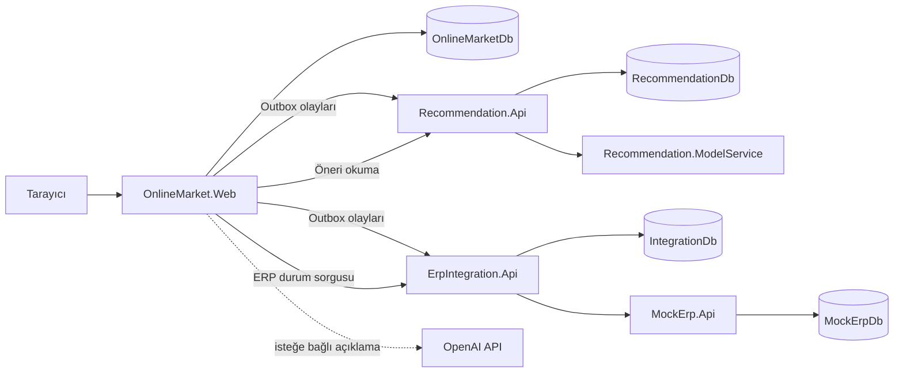
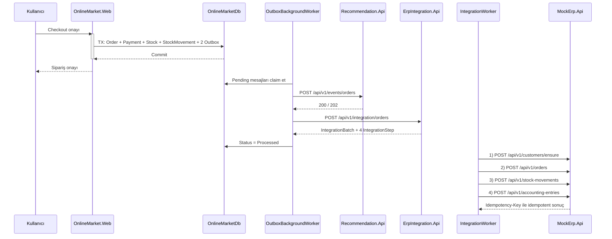

# Online Market — Öneri ve ERP Entegrasyon Sistemi

ASP.NET Core tabanlı bir online market uygulaması ile alışveriş davranışına
dayalı bir öneri sistemi ve ERP entegrasyon simülasyonunu bir araya getiren
Uyumsoft stajyerlik projesidir.

Sistem şunlardan oluşur:

- **OnlineMarket.Web** — müşterinin gördüğü mağaza (ASP.NET Core MVC).
- **Recommendation.Api** — öneri hesaplama ve sunma servisi (C#).
- **Recommendation.ModelService** — TF-IDF, ALS ve hibrit modelleri eğiten
  dahili Python servisi (FastAPI).
- **ErpIntegration.Api** — onaylanmış siparişleri ERP akışına taşıyan servis.
- **MockErp.Api** — ERP davranışını taklit eden simülasyon servisi.

Onaylanan siparişler, aşağı akış servisleri geçici olarak erişilemez olsa bile
kaybolmaz: olaylar **Transactional Outbox** deseniyle `OnlineMarketDb` içinde
sipariş ile aynı transaction'da saklanır ve arka plan işçisi tarafından
dayanıklı biçimde teslim edilir.

> **Önemli:** `MockErp.Api` gerçek bir Uyumsoft ERP servisi **değildir**.
> Gerçek ERP davranışını taklit eden, bu proje kapsamında yazılmış bir
> simülasyondur. Sistem gerçek bir Uyumsoft ERP kurulumuna bağlanmaz.

---

## 1. Projenin Amacı

Çözülmek istenen iş problemi:

- Müşteriye alışveriş davranışına dayalı, **kişiselleştirilmiş ve bağlama
  duyarlı** ürün önerileri sunmak.
- Sepetteki ürünlere göre **sepet tamamlama** önerileri üretmek.
- Onaylanan siparişleri **ERP tarzı bir iş akışına** aktarmak.
- Müşteri, sipariş, stok ve muhasebe kayıtlarını bu akışta **otomatik olarak**
  oluşturmak.
- Aşağı akış servisleri geçici olarak erişilemez olduğunda **siparişi
  kaybetmemek**.
- Tekrar denemelerde **mükerrer kayıt oluşmasını idempotency ile engellemek**.

---

## 2. Temel Yetenekler

Bu bölümde yalnızca kaynak kodda doğrulanmış davranışlar listelenmiştir.

### 2.1 Mağaza (OnlineMarket.Web)

- ASP.NET Core Identity ile kayıt, giriş, çıkış ve rol yönetimi
  (`Customer`, `Admin`).
- Kategori, marka ve ürün kataloğu; arama, kategori/marka/fiyat filtresi ve
  sıralama.
- Ürün detay sayfası; ilgili "benzer ürünler" ve "birlikte alınanlar"
  bölümleri.
- Sepet işlemleri (ekleme, adet güncelleme, silme).
- Checkout: sipariş, adres anlık görüntüsü, KDV ayrıştırmalı kalemler, ödeme
  simülasyonu, atomik stok düşümü ve stok hareketleri.
- Sipariş geçmişi ve sipariş detayı; ERP transfer durumu `ErpIntegration.Api`
  üzerinden sorgulanır.
- Admin paneli: ürün oluşturma/düzenleme, stok düzeltme, Outbox izleme ve
  Outbox'ı elle tetikleme, görsel eşleştirme.
- Ürün görselleri `wwwroot/uploads/products` altında tutulur ve
  `/uploads/products/{fileName}` yolundan sunulur.

### 2.2 Öneri Sistemi

Beş öneri türü uçtan uca çalışır:

| Tür | Uç nokta |
|---|---|
| Popüler ürünler | `GET /api/v1/recommendations/popular` |
| Kişiselleştirilmiş | `GET /api/v1/recommendations/customers/{customerId}` |
| Birlikte alınanlar (FBT) | `GET /api/v1/recommendations/fbt/{productId}` |
| Sepet tamamlama | `POST /api/v1/recommendations/cart` |
| Benzer ürünler | `GET /api/v1/recommendations/similar/{productId}` |

Ek olarak:

- Ürün ve sipariş olayları Outbox üzerinden alınır ve `ProductSnapshot` /
  `OrderSnapshot` kayıtlarına dönüştürülür.
- Müşteri kimliği, HMAC-SHA256 ile **takma ad (pseudonymous) `SubjectId`**
  değerine dönüştürülür; Python servisi doğrudan `CustomerId` görmez.
- Python model servisi **TF-IDF** içerik benzerliği ve **implicit ALS**
  matris ayrıştırması eğitir, bunları **hibrit sıralama** ile birleştirir.
- Yeterli veri yoksa ALS `InsufficientData` durumuna düşer, TF-IDF ve
  popülerlik geri dönüşleri devrede kalır.
- Model yeniden hesaplama **elle** tetiklenir
  (`POST /api/v1/recommendations/recalculate-models`).
- **Zamansal (temporal) değerlendirme** ayrı bir uç noktayla çalıştırılır
  (`POST /api/v1/recommendations/evaluate-models`).
- `OnlineMarket.Web` gösterim öncesinde ürünleri kendi kataloğundan **yeniden
  doğrular** (aktiflik ve stok kontrolü).

> Bu depoda **otomatik yeniden eğitim zamanlayıcısı** ve **sentetik veri
> üretici servisi** bulunmamaktadır. Eğitim ve değerlendirme elle tetiklenir.

### 2.3 Yapay Zekâ Asistanı

- Mağaza sayfalarının sağ alt köşesinde sabit bir widget olarak görünür.
- Hem **misafir** hem **giriş yapmış** kullanıcı için çalışır.
- Türkçe niyet yönlendirmesi **deterministik C# kodu** ile yapılır
  (`AiIntentRouter`).
- **Ürün önerilerinin tek yetkili kaynağı `Recommendation.Api`'dir.**
- OpenAI yalnızca **isteğe bağlı doğal dil açıklaması** (ve belirsiz mesajlarda
  niyet sınıflandırma yardımı) için kullanılır; ürün seçemez, sıralayamaz ve
  listeye ürün ekleyemez.
- OpenAI anahtarı tanımlı değilse widget görünür kalır, öneriler çalışmaya
  devam eder ve **deterministik Türkçe şablon metni** kullanılır.
- Ürün kartları, öneri motorunun döndürdüğü kimliklerden **güncel katalog
  verisiyle sunucu tarafında yeniden inşa edilir**.
- OpenAI'ye `CustomerId`, `SubjectId`, e-posta, adres, telefon, sipariş
  yükü veya API anahtarı **gönderilmez**.

### 2.4 ERP Entegrasyonu

- `OrderReadyForErpV1` olayı `IntegrationBatch` ve **dört `IntegrationStep`**
  kaydı oluşturur.
- Dört adımlı durum makinesi sırayla yürütülür:
  1. `EnsureCustomer`
  2. `CreateOrder`
  3. `CreateStockMovement`
  4. `CreateAccountingEntry`
- Arka plan işçisi (`IntegrationWorker`) adımları SQL kilidi altında talep
  eder, süresi dolan kilitleri geri alır ve her denemeyi kalıcı olarak yazar.
- Üstel geri çekilmeli (backoff) yeniden deneme, kalıcı/geçici hata ayrımı ve
  `MockErpCircuitBreaker` devre kesici uygulanır.
- Elle yeniden deneme: `POST /api/v1/integration/orders/{orderId}/retry`.
- `MockErp.Api` müşteri, sipariş, stok hareketi ve muhasebe fişi kayıtlarını
  `Idempotency-Key` başlığıyla idempotent şekilde saklar; aynı anahtarla farklı
  gövde gönderilirse çakışma olarak reddedilir.
- Müşterinin ERP sipariş geçmişi
  `GET /api/v1/integration/customers/{customerId}/orders` ile sorgulanır.

---

## 3. Mimari

Proje **seçici mikroservis (hibrit)** mimarisi kullanır: bağımsız dağıtılabilen
servisler vardır, ancak her şey mikroservise bölünmemiştir.

Dağıtılabilir uygulamalar:

- `src/OnlineMarket.Web`
- `src/Recommendation.Api`
- `src/ErpIntegration.Api`
- `src/MockErp.Api`
- `src/Recommendation.ModelService` (Python, dahili)

Dört adet eşleşen .NET test projesi bulunur:
`tests/OnlineMarket.Web.Tests`, `tests/Recommendation.Api.Tests`,
`tests/ErpIntegration.Api.Tests`, `tests/MockErp.Api.Tests`.

Mimari kurallar:

- Dağıtılabilir servisler **`DbContext` paylaşmaz**.
- Hiçbir servis başka bir servisin veritabanını **doğrudan sorgulamaz**.
- İletişim yalnızca **HTTP/JSON ve olaylar** üzerinden yapılır.
- `Recommendation.ModelService`, `Recommendation.Api`'nin **dahili
  bağımlılığıdır**.
- `OnlineMarket.Web` Python model servisini **hiçbir zaman doğrudan
  çağırmaz**.
- Tarayıcı yalnızca `OnlineMarket.Web` ile konuşur.



---

## 4. Veritabanı Sahipliği

| Veritabanı | Sahibi | EF Core context | Sorumluluk |
|---|---|---|---|
| `OnlineMarketDb` | `OnlineMarket.Web` | `OnlineMarketDbContext` | Kullanıcı/kimlik, katalog, stok, sepet, sipariş, ödeme, Outbox |
| `RecommendationDb` | `Recommendation.Api` | `RecommendationDbContext` | Ürün/sipariş anlık görüntüleri, `SubjectId`, öneri çıktıları, model/değerlendirme kayıtları |
| `IntegrationDb` | `ErpIntegration.Api` | `IntegrationDbContext` | `IntegrationBatch`, `IntegrationStep`, `IntegrationAttempt`, ERP müşteri eşlemesi, işlenmiş olaylar |
| `MockErpDb` | `MockErp.Api` | `MockErpDbContext` | Simüle ERP müşteri, sipariş, stok kartı/hareketi, muhasebe fişi ve idempotency kayıtları |

Kurallar:

- **Veritabanları arası foreign key yoktur.**
- **Veritabanları arası join yoktur.**
- Dış kimlikler (`ProductId`, `CustomerId`, `OrderId`) **kopyalanmış
  değerlerdir**, SQL ilişkisi değildir.
- Şemanın çalıştırılabilir doğruluk kaynağı **EF Core migration'larıdır**.
  Migration konumları:
  - [src/OnlineMarket.Web/Infrastructure/Persistence/Migrations/](src/OnlineMarket.Web/Infrastructure/Persistence/Migrations/)
  - [src/Recommendation.Api/Infrastructure/Persistence/Migrations/](src/Recommendation.Api/Infrastructure/Persistence/Migrations/)
  - [src/ErpIntegration.Api/Infrastructure/Persistence/Migrations/](src/ErpIntegration.Api/Infrastructure/Persistence/Migrations/)
  - [src/MockErp.Api/Infrastructure/Persistence/Migrations/](src/MockErp.Api/Infrastructure/Persistence/Migrations/)

---

## 5. Uçtan Uca Sipariş Akışı

1. Kullanıcı checkout'u onaylar.
2. Sipariş, adres anlık görüntüsü, kalemler, ödeme simülasyonu, stok düşümü,
   stok hareketleri, sepet durumu ve **iki Outbox kaydı** tek bir
   `OnlineMarketDb` transaction'ında commit edilir.
3. **Checkout transaction'ı içinde hiçbir aşağı akış HTTP çağrısı
   yapılmaz.**
4. `OutboxBackgroundWorker` mesajları talep eder (claim) ve teslim eder.
5. `OrderConfirmedForRecommendationV1` → `Recommendation.Api` anlık görüntüyü
   oluşturur/günceller.
6. `OrderReadyForErpV1` → `ErpIntegration.Api` bir `IntegrationBatch` ve dört
   `IntegrationStep` oluşturur.
7. `IntegrationWorker` adımları sırayla yürütür:
   `EnsureCustomer` → `CreateOrder` → `CreateStockMovement` →
   `CreateAccountingEntry`.
8. `MockErp.Api` simüle müşteri/sipariş/stok/muhasebe kayıtlarını yazar.
9. Yeniden deneme ve idempotency, mesaj kaybını ve mükerrer işlemi engeller.



---

## 6. Öneri Mimarisi

**Veri girişi.** `Recommendation.Api` yalnızca Outbox olaylarıyla beslenir:
`ProductSnapshotChangedV1` → `ProductSnapshot`,
`OrderConfirmedForRecommendationV1` → `OrderSnapshot`. Eksik ürün anlık
görüntüsü olayı `Recommendation.ProductSnapshotMissing` ile yeniden
denenebilir hata olarak reddeder; eski olay daha yeni anlık görüntünün üzerine
yazmaz (`SourceUpdatedAtUtc` karşılaştırması).

**Takma adlaştırma.** `HmacRecommendationSubjectIdDeriver`, market
`CustomerId` değerinden HMAC-SHA256 ile sürümlü ve kararlı bir `SubjectId`
türetir. Python servisine yalnızca bu opak değer gider.

**C# tarafındaki hesaplamalar.** Popülerlik, FBT birliktelik kuralları ve
sepet tamamlama skorları `Recommendation.Api` içinde SQL üzerinden hesaplanır
ve `RecommendationDb`'ye yazılır. Ağırlıklar `Recommendation:*` yapılandırma
bölümlerinden okunur.

**Python model servisi.** İçerik tabanlı **TF-IDF** ürün vektörleri,
**implicit ALS** matris ayrıştırması ve bu bileşenleri normalize edip
birleştiren **hibrit sıralama** burada eğitilir. Eğitim çıktıları artifact
olarak diske yazılır (`/app/artifacts` volume'ü) ve servis yeniden başladığında
en son geçerli artifact yüklenir. Yeterli etkileşim yoksa ALS bileşeni
`InsufficientData` olarak raporlanır ve TF-IDF/popülerlik geri dönüşleri
devrede kalır.

**Geri dönüş (fallback) zinciri.** Kişisel geçmiş yetersizse öneri motoru
popüler ürünlere düşer. `Recommendation.ModelService` erişilemezse
`Recommendation.Api` devre kesiciyi açar ve model tabanlı yolları atlayarak
SQL tabanlı sonuçları döndürür.

**Nihai doğrulama.** `OnlineMarket.Web`, öneri motorundan gelen ürün
kimliklerini kendi kataloğundan tekrar okur; yalnızca **aktif ve stokta olan**
ürünler kullanıcıya gösterilir. Öneri sıralaması burada değiştirilmez.

### 6.1 Doğrulanmış değerlendirme sonuçları

Aşağıdaki değerler bu depodaki tek değerlendirme raporundan alınmıştır:

- Kaynak dosya:
  [src/Recommendation.ModelService/evaluation-reports/](src/Recommendation.ModelService/evaluation-reports/)
  `evaluation-temporal-v1-20260805123728301-2ac82ad6e0ba4cce8c32a8eda193d668.json`
- Değerlendirme zamanı (`evaluatedAtUtc`): **2026-08-05T12:37:28Z**
- Veri kümesi: 502 sipariş, 110 subject, 205 ürün, 1505 etkileşim
- Protokol: kronolojik (temporal) holdout, K = 5
  (`RECOMMENDATION_EVALUATION_K` varsayılanı)

| Model | Precision@5 | Recall@5 | HitRate@5 | NDCG@5 | Katalog kapsamı |
|---|---|---|---|---|---|
| Hybrid | 0.1000 | 0.1585 | 0.4000 | 0.1383 | 0.8537 |
| ALS | 0.0873 | 0.1456 | 0.3727 | 0.1266 | 0.8927 |
| Popularity | 0.0018 | 0.0018 | 0.0091 | 0.0019 | 0.0390 |

Raporun kendi belirttiği sınırlar: TF-IDF (Similar) ve FBT bu protokolle
**değerlendirilmemiştir** (`NotEvaluated`); zamanlama ölçümleri çalışma
ortamına bağlıdır; hibrit ağırlıklar bu holdout üzerinde ayarlanmamıştır;
kronolojik holdout iş etkisini değil çevrimdışı sıralama kalitesini ölçer.

> Bu sayılar yalnızca yukarıdaki tarihli rapora aittir. Veri değişirse rapor
> yeniden üretilmeli ve alıntılanan değerler güncellenmelidir.

---

## 7. Yapay Zekâ Asistanı Mimarisi

```text
Tarayıcı
  -> OnlineMarket.Web / AiSupportController
  -> AiSupportService (deterministik niyet yönlendirme)
  -> AiRecommendationOrchestrator
  -> IRecommendationClient
  -> Recommendation.Api
  -> güncel katalog doğrulaması (ICatalogService)
  -> isteğe bağlı OpenAI açıklaması
  -> yapılandırılmış yanıt (metin + ürün kartları)
```

Desteklenen niyetler ve eşlendikleri uç noktalar:

| Niyet | Davranış |
|---|---|
| Genel öneri (`GeneralRecommendation`) | Giriş yapmışsa `customers/{id}`, misafirse `popular` |
| `Popular` | `popular` |
| `Similar` | `similar/{productId}` |
| `FrequentlyBoughtTogether` | `fbt/{productId}` |
| `CartCompletion` | `cart` (sepet **sunucu tarafında** okunur) |
| Açıklama isteme / öneri dışı yardım | Öneri motoru çağrılmaz; deterministik mağaza yardımı |

Güvenlik sınırı: sohbet mesajıyla **operasyonel uç noktalar çağrılamaz**.
Model yeniden hesaplama (`recalculate-models`, `recalculate`,
`recalculate-fbt`), değerlendirme (`evaluate-models`), olay yükleme
(`/api/v1/events/*`) ve subject backfill (`subjects/backfill`) asistan
üzerinden erişilebilir değildir; `IRecommendationClient` yalnızca beş okuma
işlemi tanımlar.

---

## 8. Teknoloji Yığını

Sürümler depo dosyalarından okunmuştur.

| Alan | Teknoloji / sürüm | Kaynak |
|---|---|---|
| .NET SDK | 10.0.300 (`rollForward: latestFeature`) | [global.json](global.json) |
| Hedef framework | `net10.0` | [Directory.Build.props](Directory.Build.props) |
| Web UI | ASP.NET Core MVC | `src/OnlineMarket.Web` |
| API'ler | ASP.NET Core Web API (controller tabanlı) | `src/*.Api` |
| ORM | Entity Framework Core 10.0.0 | `*.csproj` |
| Veritabanı | SQL Server 2022 (`2022-CU22-GDR1-ubuntu-22.04`, digest sabitli) | [deploy/docker-compose.database.yml](deploy/docker-compose.database.yml) |
| Kimlik | Microsoft.AspNetCore.Identity.EntityFrameworkCore 10.0.0 | `OnlineMarket.Web.csproj` |
| OpenAPI | Microsoft.AspNetCore.OpenApi 10.0.10 + Microsoft.OpenApi 2.7.5 | `*.Api.csproj` |
| API dokümantasyonu | Scalar.AspNetCore 2.16.17 | `*.Api.csproj` |
| Excel | ClosedXML 0.105.1 | `OnlineMarket.Web.csproj`, `MockErp.Api.csproj` |
| Test | xUnit 2.9.3, Microsoft.NET.Test.Sdk 18.8.1, coverlet.collector 10.0.1 | `tests/*.csproj` |
| Entegrasyon testi | Testcontainers.MsSql 4.3.0, Microsoft.AspNetCore.Mvc.Testing 10.0.10 | `tests/*.csproj` |
| EF aracı | dotnet-ef 10.0.0 (depo-yerel) | [.config/dotnet-tools.json](.config/dotnet-tools.json) |
| Python | 3.13.7 | [src/Recommendation.ModelService/Dockerfile](src/Recommendation.ModelService/Dockerfile) |
| Python API | FastAPI 0.116.1, uvicorn 0.35.0, pydantic 2.12.5 | `requirements.txt` |
| Model kütüphaneleri | implicit 0.7.3, scikit-learn 1.8.0, numpy 2.5.1, scipy 1.18.0, joblib 1.5.2, threadpoolctl 3.6.0 | `requirements.txt` |
| Python test/lint | pytest 8.4.1, mypy 1.17.1, ruff 0.12.7, httpx 0.28.1 | `requirements-dev.txt` |
| Konteyner | Docker + Docker Compose | `deploy/` |
| Ön yüz | Bootstrap 5.3.2, Bootstrap Icons 1.11.2 (CDN), sade JavaScript | `Views/Shared/_Layout.cshtml` |
| LLM sağlayıcı | OpenAI uyumlu chat completions (isteğe bağlı) | `AiAssistantOptions` |

---

## 9. Depo Yapısı

```text
.
├── src/
│   ├── OnlineMarket.Web/            # Mağaza (MVC) — OnlineMarketDb sahibi
│   ├── Recommendation.Api/          # Öneri API'si — RecommendationDb sahibi
│   ├── Recommendation.ModelService/ # Python FastAPI model servisi (dahili)
│   ├── ErpIntegration.Api/          # ERP entegrasyon akışı — IntegrationDb sahibi
│   └── MockErp.Api/                 # ERP simülasyonu — MockErpDb sahibi
├── tests/                           # Her .NET uygulaması için bir test projesi
├── deploy/                          # Docker Compose ve .env şablonu
├── scripts/
│   ├── database/                    # Migration/başlatma/doğrulama PowerShell betikleri
│   └── seed/                        # catalog.v1.json ve demo ERP çalışma kitabı
└── docs/                            # Mimari, veritabanı ve bağlam dokümanları
```

Üretim projeleri:

- **`OnlineMarket.Web`** — MVC mağaza, Identity, katalog/sepet/checkout, Outbox
  üreticisi ve işçisi, admin paneli, AI asistan uç noktası.
- **`Recommendation.Api`** — olay yükleme, beş öneri türü, model orkestrasyonu
  ve değerlendirme; `X-Api-Key` ile korunur.
- **`Recommendation.ModelService`** — TF-IDF/ALS/hibrit eğitimi, çıkarım ve
  değerlendirme; veritabanı sürücüsü yoktur.
- **`ErpIntegration.Api`** — `OrderReadyForErpV1` alımı, dört adımlı durum
  makinesi, yeniden deneme ve elle retry uç noktası.
- **`MockErp.Api`** — idempotent ERP simülasyonu; müşteri, sipariş, stok
  hareketi ve muhasebe fişi.

---

## 10. Ön Koşullar

- Windows 10/11 veya Linux (geliştirme betikleri PowerShell ile yazılmıştır).
- **.NET SDK 10** (`global.json` 10.0.300'e sabitler, `latestFeature` ile ileri
  sürümlere izin verir).
- **Docker Desktop** (Windows/macOS) veya **Docker Engine** (Linux), Linux
  konteyner modunda.
- **Docker Compose** (v2, `docker compose` alt komutu).
- SQL Server 2022 konteyneri için yeterli bellek: Docker'a **en az 2 GB**
  ayrılmalıdır; aksi hâlde konteyner minimum bellek hatasıyla kapanır.
- **PowerShell 7** veya Windows PowerShell 5.1 (`scripts/database/*.ps1`).
- **Python 3.13**, yalnızca `Recommendation.ModelService`'i Docker dışında
  çalıştıracaksanız gerekir. Normal akışta Compose kullanılır.
- Visual Studio 2026 isteğe bağlıdır; `dotnet` CLI yeterlidir.

---

## 11. Yapılandırma ve Gizli Bilgiler

Hiçbir gerçek anahtar, parola veya bağlantı dizesi depoya yazılmaz.
Development ortamında **user-secrets**, dağıtımda **ortam değişkenleri**
kullanılır. Ortam değişkeni biçiminde iç içe anahtarlar çift alt çizgi (`__`)
ile ayrılır.

Aşağıdaki yer tutucular kullanılmıştır:
`<SQL_PASSWORD>`, `<RECOMMENDATION_API_KEY>`, `<MOCK_ERP_API_KEY>`,
`<MODEL_SERVICE_API_KEY>`, `<OPENAI_API_KEY>`, `<RECOMMENDATION_SUBJECT_KEY>`.

### 11.1 OnlineMarket.Web

| Anahtar | Amaç | Zorunlu | Ortam değişkeni | Güvenli örnek |
|---|---|---|---|---|
| `ConnectionStrings:OnlineMarketDb` | Market veritabanı | Evet | `ConnectionStrings__OnlineMarketDb` | `Server=127.0.0.1,1433;Database=OnlineMarketDb;User Id=sa;Password=<SQL_PASSWORD>;Encrypt=True;TrustServerCertificate=True` |
| `Services:RecommendationApi` | Öneri API taban adresi | Hayır (varsayılan `http://localhost:5008`) | `Services__RecommendationApi` | `http://localhost:5008` |
| `Services:ErpIntegrationApi` | ERP entegrasyon taban adresi | Hayır (varsayılan `http://localhost:5046`) | `Services__ErpIntegrationApi` | `http://localhost:5046` |
| `Services:RecommendationOutbox:ApiKey` | Recommendation.Api'ye gönderilen `X-Api-Key` | **Evet** (başlangıçta doğrulanır) | `Services__RecommendationOutbox__ApiKey` | `<RECOMMENDATION_API_KEY>` |
| `Services:RecommendationApiClient:ReadTimeoutSeconds` | Similar/Personalized/FBT okuma zaman aşımı (1–8 sn) | Hayır (varsayılan 4) | `Services__RecommendationApiClient__ReadTimeoutSeconds` | `4` |
| `Recommendations:Ui:PersonalizedDisplayLimit` | Ana sayfada gösterilecek kişisel öneri sayısı (1–8) | Hayır (varsayılan 8) | `Recommendations__Ui__PersonalizedDisplayLimit` | `8` |
| `AiAssistant:Enabled` | Widget görünürlüğü | Hayır (varsayılan `true`) | `AiAssistant__Enabled` | `true` |
| `AiAssistant:Provider` | `OpenAI`, `Mock` veya `GenericHttp` | Hayır | `AiAssistant__Provider` | `OpenAI` |
| `AiAssistant:EndpointUrl` | Sağlayıcı uç noktası (OpenAI için mutlak HTTPS zorunlu) | `Provider=OpenAI` ise evet | `AiAssistant__EndpointUrl` | `https://api.openai.com/v1/chat/completions` |
| `AiAssistant:ApiKey` | Sağlayıcı kimlik bilgisi | **Hayır** — boşsa deterministik metne düşer | `AiAssistant__ApiKey` | `<OPENAI_API_KEY>` |
| `AiAssistant:Model` | Model adı | `Provider=OpenAI` ise evet | `AiAssistant__Model` | `gpt-5-nano` |
| `AiAssistant:TimeoutSeconds` | Sağlayıcı zaman aşımı (1–120) | Hayır (varsayılan 20) | `AiAssistant__TimeoutSeconds` | `30` |
| `AiAssistant:Temperature` | Örnekleme sıcaklığı (0–2) | Hayır (varsayılan 0.7) | `AiAssistant__Temperature` | `0.7` |
| `SeedAdmin:Email` / `SeedAdmin:Password` | Yalnızca seed komutu için admin hesabı | Hayır | `SeedAdmin__Email` / `SeedAdmin__Password` | `<LOCAL_ADMIN_EMAIL>` / `<LOCAL_ONLY_PASSWORD>` |
| `DemoImport:CustomerPassword` | Yalnızca Excel içe aktarma komutu için | Hayır | `DemoImport__CustomerPassword` | `<LOCAL_ONLY_PASSWORD>` |

### 11.2 Recommendation.Api

| Anahtar | Amaç | Zorunlu | Ortam değişkeni | Güvenli örnek |
|---|---|---|---|---|
| `ConnectionStrings:RecommendationDb` | Öneri veritabanı | Evet | `ConnectionStrings__RecommendationDb` | `Server=127.0.0.1,1433;Database=RecommendationDb;...` |
| `Security:ApiKey` | Gelen `X-Api-Key` doğrulaması | Evet | `Security__ApiKey` | `<RECOMMENDATION_API_KEY>` |
| `RecommendationSubject:Key` | `SubjectId` HMAC anahtarı (**en az 32 bayt**) | **Evet** (başlangıçta doğrulanır) | `RecommendationSubject__Key` | `<RECOMMENDATION_SUBJECT_KEY>` |
| `RecommendationSubject:Version` | Anahtar sürümü | Hayır (varsayılan `v1`) | `RecommendationSubject__Version` | `v1` |
| `Services:RecommendationModelService:BaseAddress` | Python servisi adresi | **Evet** | `Services__RecommendationModelService__BaseAddress` | `http://127.0.0.1:8085` |
| `Services:RecommendationModelService:ApiKey` | Python servisi `X-Api-Key` | **Evet** | `Services__RecommendationModelService__ApiKey` | `<MODEL_SERVICE_API_KEY>` |
| `Services:RecommendationModelService:Timeout` | Çıkarım zaman aşımı (0.1–30 sn) | Hayır (varsayılan `00:00:03`) | `Services__RecommendationModelService__Timeout` | `00:00:03` |
| `Services:RecommendationModelService:EvaluationTimeout` | Değerlendirme zaman aşımı (1 sn–30 dk) | Hayır (varsayılan `00:02:00`) | `Services__RecommendationModelService__EvaluationTimeout` | `00:02:00` |
| `Recommendation:Popularity:*` | Popülerlik penceresi/limitleri/ağırlıkları | Hayır | `Recommendation__Popularity__WindowDays` | `30` |
| `Recommendation:FrequentlyBoughtTogether:*` | Support/confidence/lift eşikleri | Hayır | `Recommendation__FrequentlyBoughtTogether__MinimumLift` | `1.0` |
| `Recommendation:CartCompletion:*` | Sepet tamamlama skor ağırlıkları | Hayır | `Recommendation__CartCompletion__AffinityScoreWeight` | `0.45` |
| `Recommendation:Similar:*` | Benzer ürün limitleri | Hayır | `Recommendation__Similar__DefaultLimit` | `10` |
| `Recommendation:Personalized:ModelStrategy` | `Als` veya `Hybrid` | Hayır (Development'ta `Hybrid`) | `Recommendation__Personalized__ModelStrategy` | `Hybrid` |

### 11.3 ErpIntegration.Api

| Anahtar | Amaç | Zorunlu | Ortam değişkeni | Güvenli örnek |
|---|---|---|---|---|
| `ConnectionStrings:IntegrationDb` | Entegrasyon veritabanı | Evet | `ConnectionStrings__IntegrationDb` | `Server=127.0.0.1,1433;Database=IntegrationDb;...` |
| `MockErp:BaseAddress` | Mock ERP taban adresi (mutlak) | **Evet** | `MockErp__BaseAddress` | `https://localhost:7113/` |
| `MockErp:ApiKey` | Mock ERP `X-Api-Key` | **Evet** | `MockErp__ApiKey` | `<MOCK_ERP_API_KEY>` |
| `MockErp:Timeout` | İstek zaman aşımı (250 ms–30 sn) | Hayır (varsayılan `00:00:05`) | `MockErp__Timeout` | `00:00:05` |
| `MockErp:CircuitBreakerFailureThreshold` | Devre kesici eşiği (2–100) | Hayır (varsayılan 5) | `MockErp__CircuitBreakerFailureThreshold` | `5` |
| `MockErp:CircuitBreakerBreakDuration` | Devre kesici süresi (1 sn–10 dk) | Hayır (varsayılan `00:00:30`) | `MockErp__CircuitBreakerBreakDuration` | `00:00:30` |
| `IntegrationWorker:Enabled` | Arka plan işçisi | Hayır (varsayılan `true`) | `IntegrationWorker__Enabled` | `true` |
| `IntegrationWorker:PollInterval` | Yoklama aralığı | Hayır (varsayılan `00:00:03`) | `IntegrationWorker__PollInterval` | `00:00:03` |
| `IntegrationWorker:LockTimeout` | Kilit süresi | Hayır (varsayılan `00:02:00`) | `IntegrationWorker__LockTimeout` | `00:02:00` |

> `appsettings.json` içindeki `MockErp:BaseAddress` varsayılanı
> `https://localhost:7290/` değeridir ve **`MockErp.Api`'nin gerçek
> `launchSettings` portuyla eşleşmez**. Yerel çalıştırmada bu değeri
> user-secrets veya ortam değişkeniyle mutlaka geçersiz kılın.

### 11.4 MockErp.Api

| Anahtar | Amaç | Zorunlu | Ortam değişkeni | Güvenli örnek |
|---|---|---|---|---|
| `ConnectionStrings:MockErpDb` | Simüle ERP veritabanı | Evet | `ConnectionStrings__MockErpDb` | `Server=127.0.0.1,1433;Database=MockErpDb;...` |
| `Security:ApiKey` | Gelen `X-Api-Key` doğrulaması | Evet | `Security__ApiKey` | `<MOCK_ERP_API_KEY>` |

### 11.5 Recommendation.ModelService

Compose tarafından ortam değişkeniyle beslenir
([deploy/.env.example](deploy/.env.example)):

| Değişken | Amaç | Zorunlu |
|---|---|---|
| `RECOMMENDATION_MODEL_API_KEY` | `X-Api-Key` doğrulaması (`/health` hariç) | **Evet** |
| `RECOMMENDATION_MODEL_ARTIFACT_DIRECTORY` | Artifact dizini | Hayır (`/app/artifacts`) |
| `RECOMMENDATION_ALS_*` | ALS hiperparametreleri | Hayır |
| `RECOMMENDATION_HYBRID_*` | Hibrit sıralama ağırlıkları | Hayır |
| `RECOMMENDATION_EVALUATION_*` | Değerlendirme protokolü parametreleri | Hayır |

### 11.6 Gizli bilgileri güvenle ayarlama

Anahtarları **tek tek** ayarlayın. Tüm gizli bilgileri ekrana basan komutları
(`dotnet user-secrets list` gibi) kullanmayın; çıktısı loglara, ekran
görüntülerine ve rapora sızabilir.

```powershell
# SQL Server konteyneri
Copy-Item .\deploy\.env.example .\deploy\.env
# deploy/.env içindeki MSSQL_SA_PASSWORD ve RECOMMENDATION_MODEL_API_KEY
# yer tutucularını yalnızca yerel makinenizde geçerli değerlerle değiştirin.

# OnlineMarket.Web
dotnet user-secrets --project .\src\OnlineMarket.Web set "ConnectionStrings:OnlineMarketDb" "<CONNECTION_STRING>"
dotnet user-secrets --project .\src\OnlineMarket.Web set "Services:RecommendationOutbox:ApiKey" "<RECOMMENDATION_API_KEY>"
dotnet user-secrets --project .\src\OnlineMarket.Web set "Services:RecommendationApi" "http://localhost:5008"
dotnet user-secrets --project .\src\OnlineMarket.Web set "Services:ErpIntegrationApi" "http://localhost:5046"
dotnet user-secrets --project .\src\OnlineMarket.Web set "AiAssistant:ApiKey" "<OPENAI_API_KEY>"

# Recommendation.Api
dotnet user-secrets --project .\src\Recommendation.Api set "ConnectionStrings:RecommendationDb" "<CONNECTION_STRING>"
dotnet user-secrets --project .\src\Recommendation.Api set "Security:ApiKey" "<RECOMMENDATION_API_KEY>"
dotnet user-secrets --project .\src\Recommendation.Api set "RecommendationSubject:Key" "<RECOMMENDATION_SUBJECT_KEY>"
dotnet user-secrets --project .\src\Recommendation.Api set "Services:RecommendationModelService:ApiKey" "<MODEL_SERVICE_API_KEY>"

# ErpIntegration.Api
dotnet user-secrets --project .\src\ErpIntegration.Api set "ConnectionStrings:IntegrationDb" "<CONNECTION_STRING>"
dotnet user-secrets --project .\src\ErpIntegration.Api set "MockErp:BaseAddress" "https://localhost:7113/"
dotnet user-secrets --project .\src\ErpIntegration.Api set "MockErp:ApiKey" "<MOCK_ERP_API_KEY>"

# MockErp.Api
dotnet user-secrets --project .\src\MockErp.Api set "ConnectionStrings:MockErpDb" "<CONNECTION_STRING>"
dotnet user-secrets --project .\src\MockErp.Api set "Security:ApiKey" "<MOCK_ERP_API_KEY>"
```

Eşleşmesi gereken anahtar çiftleri:

- `OnlineMarket.Web / Services:RecommendationOutbox:ApiKey`
  ↔ `Recommendation.Api / Security:ApiKey`
- `ErpIntegration.Api / MockErp:ApiKey` ↔ `MockErp.Api / Security:ApiKey`
- `Recommendation.Api / Services:RecommendationModelService:ApiKey`
  ↔ `deploy/.env / RECOMMENDATION_MODEL_API_KEY`

> **Kimlik bilgisi rotasyonu:** Geliştirme sırasında bir anahtar, parola veya
> bağlantı dizesi terminal çıktısına, log dosyasına, ekran görüntüsüne veya
> paylaşılan bir belgeye düştüyse o kimlik bilgisi **açığa çıkmış sayılmalı ve
> yenilenmelidir**. Bu özellikle OpenAI anahtarı ve SQL `sa` parolası için
> geçerlidir.

---

## 12. Yerel Geliştirme Kurulumu

```powershell
# 1) Depoyu klonlayın
git clone <REPOSITORY_URL>
cd OnlineMarket

# 2) Çalışılacak dalı seçin
git checkout main

# 3) Bağımlılıkları ve depo-yerel EF aracını geri yükleyin
dotnet restore .\OnlineMarket.slnx
dotnet tool restore

# 4) Ortam dosyasını ve gizli bilgileri hazırlayın (bkz. bölüm 11.6)
Copy-Item .\deploy\.env.example .\deploy\.env
# deploy/.env içindeki yer tutucuları değiştirin, ardından user-secrets ayarlayın.

# 5) SQL Server konteynerini başlatın
.\scripts\database\start-database.ps1

# 6) Dört veritabanının migration'larını uygulayın
#    (betik, bağlantı dizelerini ortam değişkeni olarak bekler)
$env:ConnectionStrings__OnlineMarketDb   = "<ONLINEMARKETDB_CONNECTION_STRING>"
$env:ConnectionStrings__RecommendationDb = "<RECOMMENDATIONDB_CONNECTION_STRING>"
$env:ConnectionStrings__IntegrationDb    = "<INTEGRATIONDB_CONNECTION_STRING>"
$env:ConnectionStrings__MockErpDb        = "<MOCKERPDB_CONNECTION_STRING>"
.\scripts\database\migrate-all.ps1

# 7) Deterministik katalog verisini yükleyin
$env:ASPNETCORE_ENVIRONMENT = 'Development'
$env:SeedAdmin__Email    = '<LOCAL_ADMIN_EMAIL>'
$env:SeedAdmin__Password = '<LOCAL_ONLY_ADMIN_PASSWORD>'
dotnet run --project .\src\OnlineMarket.Web\OnlineMarket.Web.csproj -c Release -- --seed-development-data

# 7b) (İsteğe bağlı) Mock ERP demo stok kartlarını yükleyin
dotnet run --project .\src\MockErp.Api\MockErp.Api.csproj -c Release -- --seed-demo-stocks .\scripts\seed\demo_erp_veritabani.xlsx

# 7c) (İsteğe bağlı) Demo Excel'den geçmiş müşteri/sipariş verisini içe aktarın
$env:DemoImport__CustomerPassword = '<LOCAL_ONLY_PASSWORD>'
dotnet run --project .\src\OnlineMarket.Web\OnlineMarket.Web.csproj -c Release -- --import-demo-excel .\scripts\seed\demo_erp_veritabani.xlsx --emit-historical-erp-events
```

Servisleri **ayrı terminallerde** şu sırayla başlatın:

```powershell
# 8) Mock ERP
dotnet run --project .\src\MockErp.Api --launch-profile https

# 9) ERP entegrasyonu
dotnet run --project .\src\ErpIntegration.Api --launch-profile http

# 10) Python model servisi (Docker üzerinden)
docker compose --env-file .\deploy\.env -f .\deploy\docker-compose.development.yml up -d recommendation-model-service

# 11) Öneri API'si
dotnet run --project .\src\Recommendation.Api --launch-profile http

# 12) Mağaza
dotnet run --project .\src\OnlineMarket.Web --launch-profile http
```

```powershell
# 13) Modelleri hesaplayın (yeni sipariş verisi eklendiğinde tekrarlayın)
$headers = @{ "X-Api-Key" = "<RECOMMENDATION_API_KEY>" }
Invoke-RestMethod -Method Post -Uri "http://localhost:5008/api/v1/recommendations/recalculate"        -Headers $headers
Invoke-RestMethod -Method Post -Uri "http://localhost:5008/api/v1/recommendations/recalculate-fbt"    -Headers $headers
Invoke-RestMethod -Method Post -Uri "http://localhost:5008/api/v1/recommendations/recalculate-models" -Headers $headers
```

14) Tarayıcıda açın: <http://localhost:5117> (mağaza) ve bölüm 13'teki
dokümantasyon adresleri.

> `OnlineMarket.Web` normal başlangıçta **migration uygulamaz ve seed
> çalıştırmaz**. Seed komutu idempotenttir: yeniden çalıştırmak işlem verisini
> silmez, mükerrer katalog satırı üretmez ve mevcut stok bakiyesini
> sıfırlamaz.

---

## 13. Servis Portları ve Adresleri

Development profillerinden okunmuştur.

| Servis | HTTP | HTTPS |
|---|---|---|
| OnlineMarket.Web | `http://localhost:5117` | `https://localhost:7232` |
| Recommendation.Api | `http://localhost:5008` | `https://localhost:7021` |
| ErpIntegration.Api | `http://localhost:5046` | `https://localhost:7243` |
| MockErp.Api | `http://localhost:5140` | `https://localhost:7113` |
| Recommendation.ModelService | `http://localhost:8085` (konteynerde 8000) | — |
| SQL Server | `localhost:1433` | — |

### Etkileşimli API dokümantasyonu

| Servis | Scalar | OpenAPI belgesi | Not |
|---|---|---|---|
| Recommendation.Api | `http://localhost:5008/scalar/v1` | `http://localhost:5008/openapi/v1.json` | **Yalnızca Development** |
| ErpIntegration.Api | `http://localhost:5046/scalar/v1` | `http://localhost:5046/openapi/v1.json` | **Yalnızca Development** |
| MockErp.Api | `http://localhost:5140/scalar/v1` | `http://localhost:5140/openapi/v1.json` | **Yalnızca Development** |
| Recommendation.ModelService | — | `http://localhost:8085/openapi.json` | Swagger UI: `/docs`, ReDoc: `/redoc` |

`OnlineMarket.Web` bir MVC uygulamasıdır; OpenAPI/Scalar yayınlamaz.

`ErpIntegration.Api` ayrıca `http://localhost:5046/health` sağlık uç noktası
sunar.

> **Ortam farkı:** .NET API'lerinde Scalar ve OpenAPI yalnızca
> `ASPNETCORE_ENVIRONMENT=Development` iken haritalanır. FastAPI servisinde
> `/docs`, `/redoc` ve `/openapi.json` ortamdan bağımsız olarak açıktır; bu
> servis yalnızca dahili ağda çalıştırılmalıdır.

---

## 14. Visual Studio ile Çalıştırma

- **Başlangıç projeleri:** Solution'a sağ tıklayın →
  *Configure Startup Projects* → *Multiple startup projects*.
- Şu sırayla `Start` seçin: `MockErp.Api`, `ErpIntegration.Api`,
  `Recommendation.Api`, `OnlineMarket.Web`.
- Her proje için `http` veya `https` profilini seçin; bölüm 13'teki portlar bu
  profillerden gelir.
- **`Recommendation.ModelService` Visual Studio'dan başlatılamaz.** Python
  servisi Docker Compose ile ayrıca başlatılmalıdır (bölüm 12, adım 10).
  `Recommendation.Api` bu servise erişemezse kişiselleştirilmiş ve benzer ürün
  önerileri SQL tabanlı geri dönüşlere düşer.

### "apphost kilitli" hatası

Yeniden derleme sırasında `The process cannot access the file ...
OnlineMarket.Web.exe because it is being used by another process` hatası,
uygulamanın hâlâ çalışıyor olmasından kaynaklanır (önceki `dotnet run`,
IIS Express veya kapanmamış bir hata ayıklama oturumu).

Bir işlemi durdurmadan **önce ne olduğunu doğrulayın**. Yalnızca porta bakarak
işlem sonlandırmayın: portu Docker Desktop'ın proxy'si
(`com.docker.backend.exe`) tutuyor olabilir ve onu sonlandırmak konteynerlerinizi
bozar.

```powershell
# 1) Önce işlemin adını ve komut satırını yazdırın
Get-CimInstance Win32_Process -Filter "Name = 'OnlineMarket.Web.exe'" |
    Select-Object ProcessId, Name, CommandLine | Format-List

# 2) Yalnızca çıktının gerçekten bu projenin apphost'u olduğunu
#    doğruladıktan sonra durdurun
Stop-Process -Id <PID>
```

Port çakışmasını incelemek için de önce sahibi belirleyin:

```powershell
$owningPid = (Get-NetTCPConnection -LocalPort 5117 -State Listen).OwningProcess
Get-CimInstance Win32_Process -Filter "ProcessId = $owningPid" |
    Select-Object ProcessId, Name, CommandLine | Format-List
```

---

## 15. Migration ve Seed Komutları

Migration sahipliği:

| Veritabanı | Sahip proje | Context |
|---|---|---|
| `OnlineMarketDb` | `src/OnlineMarket.Web` | `OnlineMarketDbContext` |
| `RecommendationDb` | `src/Recommendation.Api` | `RecommendationDbContext` |
| `IntegrationDb` | `src/ErpIntegration.Api` | `IntegrationDbContext` |
| `MockErpDb` | `src/MockErp.Api` | `MockErpDbContext` |

```powershell
# Dört veritabanına mevcut migration'ları uygula
.\scripts\database\migrate-all.ps1

# Context ve veritabanı varlığını doğrula
.\scripts\database\verify-databases.ps1

# Idempotent SQL üret (scripts/database/generated/ altına yazar)
.\scripts\database\generate-migration-scripts.ps1
```

`migrate-all.ps1` yalnızca **var olan** migration'ları uygular; migration
oluşturmaz, `EnsureCreated`/`EnsureDeleted` çağırmaz ve hedefin
`127.0.0.1`/`localhost` üzerinde beklenen veritabanı adını taşıdığını doğrular.

### Katalog seed'i ve ürün görselleri

```powershell
dotnet run --project .\src\OnlineMarket.Web\OnlineMarket.Web.csproj -c Release -- --seed-development-data
```

- Kaynak: [scripts/seed/catalog.v1.json](scripts/seed/catalog.v1.json)
  (derleme çıktısına `Seed/catalog.v1.json` olarak kopyalanır).
- Komut, eksik `Customer`/`Admin` rollerini, yapılandırılmışsa admin hesabını
  ve eksik katalog/stok/ilk stok hareketi kayıtlarını oluşturur.
- **İdempotenttir:** tekrar çalıştırmak işlem verisini silmez, mükerrer seed
  satırı eklemez, mevcut stok bakiyesini sıfırlamaz.
- Seed komutunun sonunda görsel eşleştirme (`BulkMatchImagesFromFolderAsync`)
  otomatik olarak çalışır.

Görsel davranışı:

- Görsel dosyaları: `src/OnlineMarket.Web/wwwroot/uploads/products/`
- Genel URL: `/uploads/products/{fileName}`
- `catalog.v1.json` **hiç `ImageUrl` alanı içermez**; görseller yalnızca
  eşleştirme adımıyla atanır.
- Eşleştirme sırası: sıra numarası (`p_001`, `p_002`, …) → ürün adı slug'ı →
  SKU slug'ı → ham ürün adı.
- Mevcut veritabanında görselleri yeniden atamak için admin panelindeki
  **Bulk Match Images** işlemi kullanılabilir
  (`POST /Admin/BulkMatchImages`).

> **Dikkat:** Bu daldaki `BulkMatchImagesFromFolderAsync`, eşleşme bulduğunda
> ürünün mevcut `ImageUrl` değerini **koşulsuz olarak üzerine yazar**. Elle
> atanmış veya dış kaynaklı bir görsel URL'si korunmaz. Elle atadığınız
> görseller varsa bu işlemi çalıştırmadan önce yedekleyin.

---

## 16. Model Eğitimi ve Değerlendirme

Tüm çağrılar `X-Api-Key` başlığı gerektirir. Aşağıdaki örneklerde gerçek
anahtar yerine yer tutucu kullanılmıştır.

```powershell
$headers = @{ "X-Api-Key" = "<RECOMMENDATION_API_KEY>" }

# Popülerlik sıralamasını yeniden hesapla
Invoke-RestMethod -Method Post -Uri "http://localhost:5008/api/v1/recommendations/recalculate" -Headers $headers

# Birlikte alınanlar (FBT) modelini yeniden hesapla
Invoke-RestMethod -Method Post -Uri "http://localhost:5008/api/v1/recommendations/recalculate-fbt" -Headers $headers

# TF-IDF + ALS + hibrit modelleri eğit
Invoke-RestMethod -Method Post -Uri "http://localhost:5008/api/v1/recommendations/recalculate-models" -Headers $headers

# Çevrimdışı değerlendirmeyi çalıştır (precision/recall/hit-rate/NDCG)
Invoke-RestMethod -Method Post -Uri "http://localhost:5008/api/v1/recommendations/evaluate-models" -Headers $headers
```

Model servisini doğrudan kontrol etmek için:

```powershell
# Sağlık (anahtar gerektirmez)
Invoke-RestMethod -Uri "http://localhost:8085/health"

# Yüklü modelin meta verisi
Invoke-RestMethod -Uri "http://localhost:8085/api/v1/models/current" `
                  -Headers @{ "X-Api-Key" = "<MODEL_SERVICE_API_KEY>" }
```

Artifact ve rapor konumları:

- Konteyner içinde `/app/artifacts` → `recommendation_model_artifacts` volume'ü
- Konteyner içinde `/app/evaluation-reports` →
  `recommendation_evaluation_reports` volume'ü
- Depoya işlenmiş örnek rapor:
  [src/Recommendation.ModelService/evaluation-reports/](src/Recommendation.ModelService/evaluation-reports/)

Servis yeniden başladığında en son geçerli artifact'i yükler.
`recalculate-models` çağrıları eşzamanlı çalıştırılamaz; devam eden bir eğitim
varsa istek reddedilir. `recalculate` ve `recalculate-fbt` aynı anda ikinci kez
çağrılırsa **409 Conflict** döner ve kuyruğa alınmaz.

**Model servisi erişilemezse:** `Recommendation.Api` devre kesiciyi açar,
`recalculate-models` ve `evaluate-models` **503** döndürür, ancak popülerlik,
FBT ve sepet tamamlama gibi SQL tabanlı öneriler çalışmaya devam eder.
Kişiselleştirilmiş ve benzer ürün sonuçları geri dönüş stratejisine düşer.

---

## 17. Test ve Güvenlik Denetimi

```powershell
dotnet restore .\OnlineMarket.slnx
dotnet build   .\OnlineMarket.slnx -c Release
dotnet test    .\OnlineMarket.slnx -c Release --no-build
dotnet package list --project .\OnlineMarket.slnx --include-transitive --vulnerable
git diff --check
```

Python model servisi testleri:

```powershell
cd .\src\Recommendation.ModelService
python -m venv .venv
.\.venv\Scripts\Activate.ps1
pip install -r requirements-dev.txt
pytest
```

Bu README hazırlanırken doğrulanan sonuç (**2026-08-06**):

| Test projesi | Sonuç |
|---|---|
| `OnlineMarket.Web.Tests` | 208/208 başarılı |
| `Recommendation.Api.Tests` | 122/122 başarılı |
| `ErpIntegration.Api.Tests` | 72/72 başarılı |
| `MockErp.Api.Tests` | 67/67 başarılı |
| **.NET toplam** | **469/469 başarılı** |
| `Recommendation.ModelService` (pytest) | 70/70 başarılı |

Aynı tarihte `dotnet build -c Release` **0 uyarı / 0 hata** ile tamamlandı ve
güvenlik denetimi sekiz projenin tamamı için **savunmasız paket bulunmadığını**
raporladı.

> Testler `Testcontainers.MsSql` kullanarak gerçek bir SQL Server konteyneri
> başlatır; çalıştırmadan önce Docker'ın açık olması gerekir. Yukarıdaki
> sayılar sabit değildir — kod değiştiğinde komutu tekrar çalıştırıp
> güncelleyin.

---

## 18. API Dokümantasyonu

| Servis | Adres |
|---|---|
| Recommendation.Api (Scalar) | `http://localhost:5008/scalar/v1` |
| ErpIntegration.Api (Scalar) | `http://localhost:5046/scalar/v1` |
| MockErp.Api (Scalar) | `http://localhost:5140/scalar/v1` |
| ModelService (Swagger UI) | `http://localhost:8085/docs` |
| ModelService (ReDoc) | `http://localhost:8085/redoc` |

Scalar arayüzünde korumalı uç noktaları denemek için sağ üstteki
**Authentication** bölümünden `ApiKey` şemasını seçin ve `X-Api-Key` alanına
ilgili servisin anahtarını girin:

- Recommendation.Api → `Security:ApiKey` değeri
- MockErp.Api → `Security:ApiKey` değeri
- ErpIntegration.Api → **anahtar gerekmez** (bkz. bölüm 20)

Anahtar değerleri bu dokümanda veya ekran görüntülerinde paylaşılmamalıdır.

---

## 19. Demo Senaryosu

1. Kayıt olun veya giriş yapın.
2. Katalogda gezinin; ürün görsellerinin yüklendiğini gösterin.
3. Ana sayfada popüler ve (giriş yapıldıysa) kişiselleştirilmiş önerileri
   gösterin.
4. Bir ürün detayına girin; "benzer ürünler" ve "birlikte alınanlar"
   bölümlerini gösterin.
5. Sepete birkaç ürün ekleyin.
6. Sağ alttaki AI asistanını açın ve sırasıyla deneyin:
   *"En popüler ürünler neler?"*, *"Bana ürün öner"*,
   *"Buna benzer ürünler göster"*, *"Bunu alanlar başka ne alıyor?"*,
   *"Sepetimi tamamla"*.
7. Checkout'u tamamlayın.
8. Admin → Outbox ekranında yeni Outbox satırlarını gösterin.
9. `RecommendationDb` üzerinde yeni `OrderSnapshot` kaydını gösterin.
10. `GET /api/v1/integration/jobs` ile `IntegrationBatch` ve dört
    `IntegrationStep` kaydını gösterin.
11. `MockErpDb` üzerinde simüle sipariş, stok hareketi ve muhasebe fişi
    kayıtlarını gösterin.
12. `recalculate`, `recalculate-fbt` ve `recalculate-models` çağrılarını
    çalıştırın.
13. Ana sayfayı yenileyerek kişiselleştirilmiş önerilerin güncellendiğini
    gösterin.
14. Scalar ve FastAPI dokümantasyon sayfalarını açın.
15. `dotnet test` çıktısını gösterin.

---

## 20. Güvenlik ve Dayanıklılık

Uygulanmış kontroller:

- **Kimlik doğrulama:** ASP.NET Core Identity (çerez tabanlı), rol bazlı admin
  yetkilendirmesi.
- **Gizli bilgi yönetimi:** anahtarlar yalnızca sunucu tarafında; user-secrets
  ve ortam değişkenleri; `appsettings.json` içinde boş yer tutucular.
- **API anahtarı doğrulaması:** `Recommendation.Api`, `MockErp.Api` ve
  `Recommendation.ModelService` `X-Api-Key` başlığı ister;
  `Recommendation.Api` fallback yetkilendirme politikasıyla varsayılan olarak
  tüm uç noktaları korur.
- **Antiforgery:** MVC form gönderimleri ve AI asistanın POST isteği
  `ValidateAntiForgeryToken` ile doğrulanır.
- **Girdi doğrulama:** API'lerde `JsonUnmappedMemberHandling.Disallow` ile
  bilinmeyen JSON alanları reddedilir; model doğrulama hataları standart hata
  gövdesine dönüştürülür.
- **Transactional Outbox:** sipariş ve olay kaydı tek transaction'da commit
  edilir; checkout içinde dış HTTP çağrısı yoktur.
- **Idempotency:** Mock ERP çağrıları kararlı `Idempotency-Key` ile yapılır;
  aynı anahtar farklı gövdeyle gelirse çakışma olarak reddedilir.
- **Correlation ID:** olaylar ve entegrasyon kayıtları uçtan uca korelasyon
  kimliği taşır.
- **Yeniden deneme ve backoff:** Outbox en fazla **5 deneme** yapar, sonrasında
  `Delivery.RetryExhausted` ile kalıcı hataya geçer; entegrasyon adımları
  üstel gecikmeyle yeniden denenir.
- **Devre kesici:** `MockErpCircuitBreaker` (varsayılan 5 hata / 30 sn) ve
  `RecommendationModelCircuitBreaker`.
- **SQL işçi kilidi:** Outbox ve entegrasyon adımları kilitlenerek talep
  edilir; süresi dolan kilitler geri alınır.
- **Sınırlı zaman aşımları:** öneri okumaları 1–8 sn arasında yapılandırılır,
  Mock ERP çağrıları 250 ms–30 sn, model çıkarımı varsayılan 3 sn.
- **Hata maskeleme:** Outbox ve entegrasyon kayıtlarında hata metinleri
  maskelenerek saklanır; sağlayıcı hata detayları tarayıcıya gönderilmez.
- **Hız sınırlama:** `MockErp.Api` sabit pencere limiti (120 istek/dakika).
- **Kart verisi saklanmaz:** `Payment` varlığı yalnızca ödeme yöntemi, durum,
  tutar ve simülasyon referansı tutar — **hiçbir kart alanı kalıcı hâle
  getirilmez**. Checkout formundaki maskelenmiş kart bilgisi veritabanına
  yazılmaz; kart numarası, CVV ve son kullanma tarihi ERP olayına da konmaz.
- **OpenAI gizliliği:** `CustomerId`, `SubjectId`, e-posta, adres, telefon,
  sipariş yükü ve API anahtarları sağlayıcıya gönderilmez.
- **Takma adlaştırma:** Python servisi doğrudan müşteri kimliği yerine
  HMAC-SHA256 türetilmiş `SubjectId` görür.
- **Paket denetimi:** `dotnet package list --vulnerable` ile düzenli tarama;
  `Directory.Build.props` uyarıları hata sayar (`TreatWarningsAsErrors`).

**Açıkça belirtilen güvenlik sınırı:** `ErpIntegration.Api` şu anda **API
anahtarı doğrulaması uygulamaz**. Bu durum servisin kendi OpenAPI açıklamasında
da belirtilmiştir ve güvenilir iç ağ varsayımına dayanır. Bkz. bölüm 21.

---

## 21. Bilinen Sınırlamalar

- `MockErp.Api` bir **simülasyondur**; gerçek Uyumsoft ERP entegrasyonu
  yapılmamıştır.
- `ErpIntegration.Api` **API anahtarı doğrulaması yapmaz**; yalnızca güvenilir
  iç ağda çalıştırılmalıdır. Diğer iki .NET API'si anahtar ister — yani
  **tüm servisler aynı kimlik doğrulama politikasına sahip değildir**.
- OpenAI entegrasyonu **isteğe bağlıdır**; anahtar yoksa asistan deterministik
  Türkçe metinle çalışır.
- Model yeniden hesaplama ve değerlendirme **elle tetiklenir**; **otomatik
  yeniden eğitim zamanlayıcısı yoktur**.
- Öneri okuma zaman aşımları türlere göre **farklıdır**: Similar, Personalized
  ve FBT yapılandırılabilir ortak bütçeyi (varsayılan 4 sn) kullanır; Popular
  ve CartCompletion hâlâ kendi kısa 500 ms bütçelerini kullanır.
- TF-IDF (Similar) ve FBT için **çevrimdışı değerlendirme protokolü
  uygulanmamıştır**; mevcut rapor bunları `NotEvaluated` olarak işaretler.
- Öneri kalitesi mevcut sipariş geçmişine bağlıdır; veri azaldıkça ALS
  `InsufficientData` durumuna düşer ve popülerlik ağırlık kazanır.
- Yerel geliştirmede dört veritabanı **tek bir SQL Server örneğini** paylaşır;
  mantıksal ayrım (ayrı context, cross-db sorgu yok) korunur ama fiziksel
  izolasyon yoktur.
- Seed, demo Excel içe aktarma ve `--seed-demo-stocks` komutları
  **yalnızca Development** ortamında çalışır.
- Görsel eşleştirme mevcut `ImageUrl` değerlerini üzerine yazar (bkz. bölüm 15).
- FastAPI dokümantasyonu ortamdan bağımsız olarak açıktır; .NET API'lerinde
  ise yalnızca Development'ta yayınlanır.
- `Recommendation.Api` içinde şablondan kalan `WeatherForecastController`
  bulunmaktadır ve işlevsel bir rol taşımaz.

---

## 22. Sorun Giderme

| Belirti | Neden | Çözüm |
|---|---|---|
| `OnlineMarket.Web.exe ... used by another process` | Uygulama hâlâ çalışıyor | Bölüm 14'teki güvenli işlem inceleme adımlarını uygulayın |
| `error during connect: ... docker_engine` | Docker Desktop kapalı | Docker Desktop'ı başlatıp konteynerlerin `healthy` olmasını bekleyin |
| SQL Server konteyneri hemen kapanıyor | Minimum bellek karşılanmıyor | Docker'a en az 2 GB bellek ayırın, `docker logs online-market-sqlserver` ile doğrulayın |
| `Failed to bind to address ... address already in use` | Port meşgul | Bölüm 14'teki `Get-NetTCPConnection` + `Win32_Process` adımıyla **sahibi doğrulayın**; Docker proxy'sini sonlandırmayın |
| ModelService `/docs` açılmıyor | Eski imaj/konteyner çalışıyor | `docker compose -f .\deploy\docker-compose.development.yml up -d --build recommendation-model-service` |
| Hata ayıklayıcı `TaskCanceledException` üzerinde duruyor | Zaman aşımı/iptal beklenen davranış | Debug → Windows → Exception Settings içinde bu istisnayı devre dışı bırakın; kod bunu zaten yakalar |
| Outbox satırı `FailedPermanent` / `Delivery.RetryExhausted` | 5 deneme tükendi (hedef servis kapalıydı veya anahtar yanlıştı) | Hedef servisi ve anahtarı düzeltin, ardından **Admin → Outbox → Process Outbox Now** ile yeniden deneyin |
| Entegrasyon batch'i `WaitingManualRetry` | Adım kalıcı hata verdi | `POST /api/v1/integration/orders/{orderId}/retry` ile elle tetikleyin |
| `401 Unauthorized` (Recommendation/MockErp) | Anahtar çifti eşleşmiyor | Bölüm 11.6'daki eşleşmesi gereken anahtar çiftlerini kontrol edin |
| ERP adımları hiç ilerlemiyor | `MockErp:BaseAddress` yanlış porta bakıyor | Varsayılan `https://localhost:7290/` değerini gerçek Mock ERP portuyla değiştirin |
| Ürün görselleri görünmüyor | `ImageUrl` boş veya eşleştirme çalıştırılmadı | Admin → **Bulk Match Images** çalıştırın; dosyaların `wwwroot/uploads/products` altında olduğunu doğrulayın |
| Öneri bölümleri boş | `Recommendation.Api` kapalı veya model hesaplanmadı | Servisi başlatın, ardından `recalculate` / `recalculate-fbt` / `recalculate-models` çağırın |
| AI widget var ama yanıtlar şablon gibi | OpenAI anahtarı tanımlı değil | Beklenen davranıştır; isterseniz `AiAssistant:ApiKey` ayarlayın |
| Scalar sayfası 404 | Ortam Development değil | `ASPNETCORE_ENVIRONMENT=Development` ile çalıştırın |

> **Üretim uyarısı:** Outbox veya entegrasyon durumlarını doğrudan SQL ile
> değiştirmeyin. Yukarıdaki kurtarma adımları (Admin → Process Outbox Now ve
> entegrasyon retry uç noktası) **yalnızca yerel geliştirme** içindir ve
> uygulamanın kendi idempotency kontrollerinden geçer.

---

## 23. Ekip ve Proje Bağlamı

- **Grup 16**
- Kerem Yılmaz
- Mert Danacı
- Z. Yudum Meral

Uyumsoft stajyerlik projesi kapsamında geliştirilmiştir.

> Proje dönemi/tarih aralığı bu depodaki dosyalardan doğrulanamadığı için
> bilinçli olarak yazılmamıştır. Onaylı proje belgelerinden teyit edilerek
> eklenmelidir.

Ayrıntılı bağlam, kanıt yolları ve rapor yazımı için bkz.
[docs/REPORT_WRITING_CONTEXT.md](docs/REPORT_WRITING_CONTEXT.md).

---

## 24. Lisans ve Durum

Bu depo şu anda bir açık kaynak lisansı **belirtmemektedir**
(*This repository does not currently declare an open-source license.*).

Durum: staj projesi teslimine yönelik geliştirme sürümü. Üretim ortamına
dağıtım için bölüm 21'deki sınırlamaların giderilmesi gerekir.
