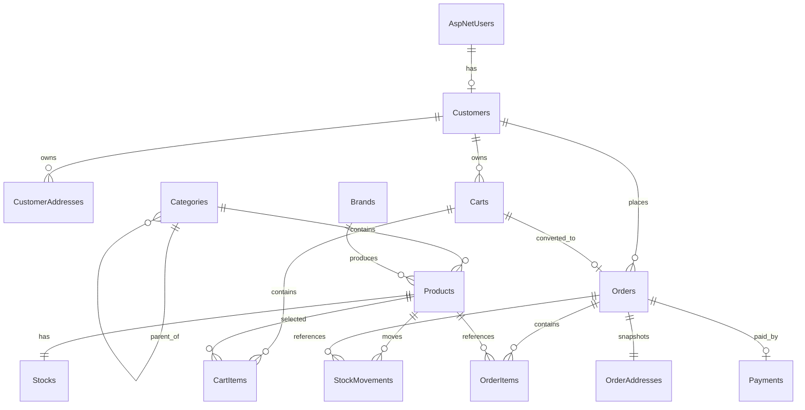
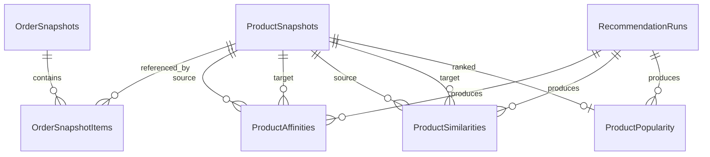
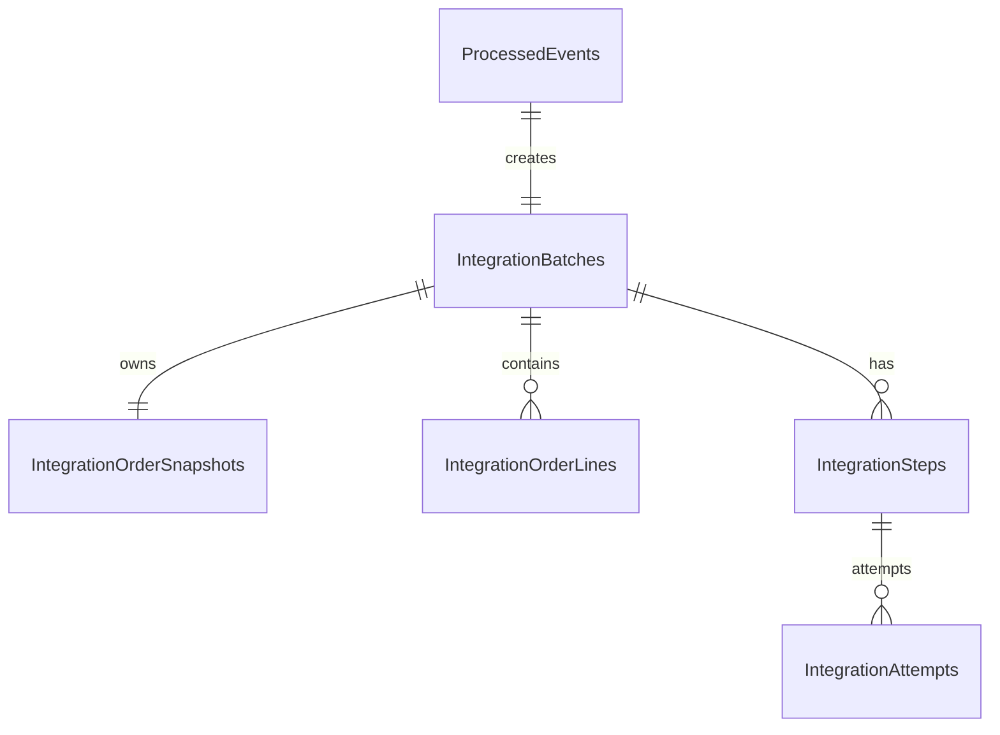
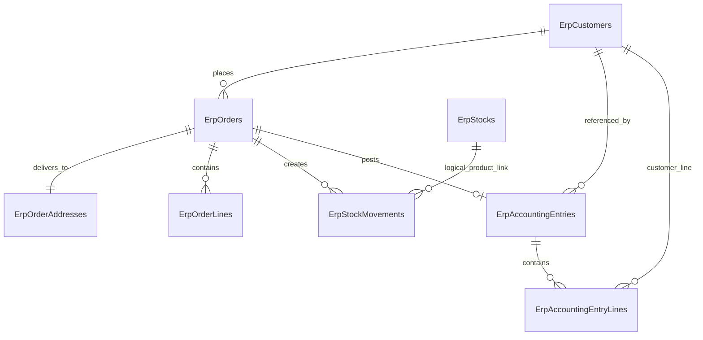

# Online Market — Authoritative Database Implementation Specification

**Audience:** Codex, Claude Code, Google Antigravity, IDE agents, reviewers, and developers  
**Platform:** .NET 10 · Entity Framework Core 10 · SQL Server 2022 · Visual Studio 2026  
**Solution:** `OnlineMarket.slnx`  
**Document role:** complete implementation contract for the four application databases

> This document is intentionally detailed. An agent may use it to create domain entities, EF Core configurations, `DbContext` classes, migrations, deterministic seed infrastructure, and database integration tests. Do not shorten, reinterpret, or redesign the schema while implementing it.

---

## 1. Authority and implementation policy

This file is the database source of truth for AI-assisted implementation.

The executable schema is produced by EF Core migrations. A migration is not accepted when it differs from this document without an approved schema decision.

When instructions conflict, use this order:

1. Approved ADR or explicit new decision.
2. This `DATABASE.md`.
3. `AGENTS.md`.
4. `docs/ai/ARCHITECTURE.md`.
5. `docs/ai/DATA_AND_CONTRACTS.md`.
6. `docs/api-contracts.md`.
7. Existing migrations and code, after confirming they are not stale.

An implementation agent must report a conflict before changing the design. It must not silently choose a different column, type, key, relationship, event name, or transaction boundary.

### 1.1 Required output of the database implementation task

The completed database foundation must contain:

- four independent `DbContext` implementations,
- all entities and enums in this specification,
- one `IEntityTypeConfiguration<T>` per mapped business entity,
- SQL Server-specific filtered unique indexes and check constraints,
- four independent initial migration sets,
- deterministic catalogue seed infrastructure,
- database creation and migration scripts,
- unit tests for pure invariants,
- SQL Server integration tests for constraints, transactions, filtered indexes, concurrency, idempotency, and worker claims,
- updated DBML and database documentation,
- ERP field-to-model parity for payment method, order address, stock card, and
  accounting voucher lines.

### 1.2 Explicitly forbidden changes

Do not:

- merge the four databases,
- use one shared `DbContext`,
- add cross-database foreign keys or queries,
- create a shared entity or shared contracts project,
- use Generic Repository or Generic Service,
- use EF Core InMemory to validate SQL constraints or concurrency,
- use `float` or `double` for financial values,
- store card number, CVV, expiry date, real payment tokens, API keys, or connection strings,
- place ERP transfer state on the Online Market `Order` aggregate,
- call Recommendation or ERP services inside the checkout SQL transaction,
- create incomplete Recommendation product snapshots from order events,
- generate a new idempotency key during retry,
- automatically run production migrations when an application starts.

---

## 2. Database topology and ownership

| Database | Owning application | DbContext | Primary responsibility |
|---|---|---|---|
| `OnlineMarketDb` | `OnlineMarket.Web` | `OnlineMarketDbContext` | Identity, customer profile, addresses, catalogue, market stock, cart, checkout, orders, payment simulation, outbox |
| `RecommendationDb` | `Recommendation.Api` | `RecommendationDbContext` | Product/order snapshots, processed events, recommendation calculations, run audit |
| `IntegrationDb` | `ErpIntegration.Api` | `IntegrationDbContext` | Durable ERP order snapshot, batches, ordered steps, attempts, retries, customer-to-ERP link |
| `MockErpDb` | `MockErp.Api` | `MockErpDbContext` | Simulated ERP customer, order/address, stock card/movement, accounting header/lines, idempotency |

### 2.1 Ownership rules

1. Each application reads and writes only its own database.
2. No cross-database `JOIN`, foreign key, view, stored procedure, synonym, or direct connection is allowed.
3. IDs copied from another service are external identifiers, not SQL foreign keys.
4. `OnlineMarketDb` is the authority for current product data, current sales price, VAT, and current market stock.
5. `RecommendationDb` and `IntegrationDb` contain purpose-specific snapshots.
6. `MockErpDb.ErpStocks` is a separate simulated ERP balance. It is not the same balance as `OnlineMarketDb.Stocks`.
7. The four databases may share one SQL Server instance in development, but logical ownership remains separate.
8. Prefer a different SQL login for each application.

### 2.2 Event-to-database mapping

| Event | Producer | Consumer | Durable target |
|---|---|---|---|
| `ProductSnapshotChangedV1` | `OnlineMarket.Web` | `Recommendation.Api` | `ProductSnapshots`, `ProcessedEvents` |
| `OrderConfirmedForRecommendationV1` | `OnlineMarket.Web` | `Recommendation.Api` | `OrderSnapshots`, `OrderSnapshotItems`, `ProcessedEvents` |
| `OrderReadyForErpV1` | `OnlineMarket.Web` | `ErpIntegration.Api` | `ProcessedEvents`, `IntegrationBatches`, snapshot, lines, four steps |

---

## 3. Global SQL Server and EF Core standards

### 3.1 Database technology

- SQL Server 2022 Express, Developer, LocalDB for limited local use, or SQL Server container.
- EF Core 10 Code First.
- Default schema: `dbo`.
- One migration assembly per owning application.
- One active migration owner per `DbContext`.

### 3.2 Naming

| Object | Convention | Example |
|---|---|---|
| Table | plural PascalCase | `OrderItems` |
| Column | PascalCase | `CreatedAtUtc` |
| Primary key | `PK_<Table>` | `PK_Products` |
| Foreign key | `FK_<Child>_<Parent>_<Column>` | `FK_OrderItems_Orders_OrderId` |
| Unique index | `UX_<Table>_<Columns>` | `UX_Products_Sku` |
| Normal index | `IX_<Table>_<Columns>` | `IX_Orders_CustomerId_PlacedAtUtc` |
| Check constraint | `CK_<Table>_<Rule>` | `CK_Stocks_Quantity_NonNegative` |

### 3.3 Type rules

| Data | SQL Server type | C# type / rule |
|---|---|---|
| Business and cross-service ID | `uniqueidentifier` | `Guid`, generated in application with `Guid.NewGuid()` |
| High-volume immutable technical ID | `bigint IDENTITY(1,1)` | `long` |
| Money | `decimal(18,2)` | `decimal`; never `float`/`double` |
| VAT | `decimal(5,2)` | range `0..100` |
| Recommendation score/metric | `decimal(12,6)` | support, confidence, lift, normalised scores |
| Product content amount | `decimal(12,3)` | `NetContent`; not money |
| Timestamp | `datetime2(3)` | UTC |
| Currency | `char(3)` | V1: `TRY` |
| Country | `char(2)` | V1: `TR` |
| Boolean | `bit` | `bool` |
| Enum | `tinyint` or documented `smallint` | explicit numeric C# enum values |
| JSON | `nvarchar(max)` | add `ISJSON` check |
| SHA-256 hex | `char(64)` | lower- or upper-case format must be consistent |
| Concurrency token | `rowversion` | `byte[]`, `.IsRowVersion()` |

### 3.4 String rules

- Use Unicode `nvarchar` for names, descriptions, addresses, errors, and payloads.
- Trim user-controlled string input before validation and persistence.
- Required strings must reject empty or whitespace-only values in the application layer.
- Unique text values such as SKU, slug, normalised username, order number, and ERP code must be normalised consistently before persistence.
- Do not create unbounded strings except documented JSON payload columns.

### 3.5 Money and VAT calculations

All line calculations are performed in C# with `decimal`:

```text
NetLineAmount = Round(UnitPrice * Quantity, 2)
VatAmount     = Round(NetLineAmount * VatRate / 100, 2)
LineTotal     = NetLineAmount + VatAmount
Subtotal      = Sum(rounded NetLineAmount)
VatTotal      = Sum(rounded VatAmount)
GrandTotal    = Subtotal + VatTotal
```

Use:

```csharp
MidpointRounding.AwayFromZero
```

The database stores the calculated snapshots and enforces internal equality where practical. It does not replace the application calculator.

### 3.6 Time and audit rules

- Persist all timestamps in UTC.
- Use `datetime2(3)`.
- New mutable master records normally have `CreatedAtUtc`, `UpdatedAtUtc`, and `RowVersion`.
- Immutable technical history records use creation/attempt timestamps and do not require `UpdatedAtUtc`.
- `rowversion` is not a date/time value.

### 3.7 Delete rules

- Customer, category, brand, and product: deactivate with `IsActive = 0`.
- Order, payment, stock movement, integration, ERP, event, and idempotency history: no physical deletion in normal application flows.
- Historical and financial foreign keys use `DeleteBehavior.NoAction`.
- `CartItems` may cascade if a cart is physically deleted, though normal flows do not delete carts.
- `OrderSnapshotItems` may cascade when an entire Recommendation order snapshot is deliberately removed.
- Never cascade-delete products, customers, orders, payments, stock movements, integration jobs, or ERP history.

---

## 4. Canonical enum values

### 4.1 Online Market enums

| Enum | Numeric values |
|---|---|
| `UnitType` | `1=Piece`, `2=Gram`, `3=Kilogram`, `4=Millilitre`, `5=Litre`, `6=Package` |
| `CartStatus` | `1=Active`, `2=Converted`, `3=Abandoned` |
| `OrderStatus` | `1=Confirmed`, `2=Cancelled` |
| `PaymentMethod` | `1=CashSimulation`, `2=CardSimulation`, `3=TransferSimulation` |
| `PaymentStatus` | `1=Pending`, `2=Succeeded`, `3=Failed`, `4=Cancelled` |
| `StockMovementType` | `1=Initial`, `2=AdminIncrease`, `3=AdminDecrease`, `4=Sale`, `5=Rollback`, `6=Correction` |
| `StockReferenceType` | `1=None`, `2=Order`, `3=AdminOperation`, `4=Seed` |
| `OutboxStatus` | `1=Pending`, `2=Processing`, `3=Processed`, `4=Retrying`, `5=FailedPermanent` |

### 4.2 Recommendation enums

| Enum | Numeric values |
|---|---|
| `RecommendationType` | `1=Popular`, `2=FrequentlyBoughtTogether`, `3=Similar`, `4=Personalized`, `5=CartCompletion` |
| `PreferenceType` | `1=Category`, `2=Brand`, `3=Product` |
| `RecommendationRunType` | `1=Affinity`, `2=Similarity`, `3=Popularity`, `4=CustomerPreference`, `5=Full` |
| `RecommendationRunStatus` | `1=Running`, `2=Succeeded`, `3=Failed` |

### 4.3 Integration enums

| Enum | Numeric values |
|---|---|
| `IntegrationBatchStatus` | `1=Pending`, `2=InProgress`, `3=PartiallySucceeded`, `4=Succeeded`, `5=WaitingManualRetry`, `6=FailedPermanent` |
| `IntegrationStepType` | `1=EnsureCustomer`, `2=CreateOrder`, `3=CreateStockMovement`, `4=CreateAccountingEntry` |
| `IntegrationStepStatus` | `1=Pending`, `2=InProgress`, `3=Retrying`, `4=Succeeded`, `5=FailedPermanent`, `6=WaitingManualRetry` |
| `IntegrationResultType` | `1=Succeeded`, `2=TransientFailure`, `3=PermanentFailure`, `4=IdempotentReplay` |

### 4.4 Mock ERP enums

| Enum | Numeric values |
|---|---|
| `AccountingVoucherType` | `1=SalesInvoice` |

Mock ERP defines its own local `PaymentMethod` enum with the same numeric
values as the `OrderReadyForErpV1` contract. Do not add a production project
reference to reuse the Online Market enum.

Do not reorder or renumber released enum values.

---

# 5. `OnlineMarketDb`

## 5.1 Responsibility

`OnlineMarketDb` is the market transaction database. It owns Identity, the business customer profile, addresses, catalogue, market stock, carts, checkout, orders, payment simulation, and transactional outbox.

It must not contain calculated Recommendation results or internal ERP integration state.

## 5.2 Relationship map



## 5.3 ASP.NET Core Identity tables

Use ASP.NET Core Identity with:

```csharp
IdentityUser<Guid>
IdentityRole<Guid>
```

Expected standard tables:

- `AspNetUsers`
- `AspNetRoles`
- `AspNetUserRoles`
- `AspNetUserClaims`
- `AspNetUserLogins`
- `AspNetUserTokens`
- `AspNetRoleClaims`

Identity remains responsible for password hashes, security stamps, lockout, normalised email and username, tokens, claims, and role membership.

Do not duplicate password hashes or authentication tokens in business tables.

Expected important indexes:

- unique normalised username index generated by Identity,
- normalised email index,
- unique normalised role-name index.


### `Customers`

Business profile linked one-to-one with the ASP.NET Core Identity user.

| Column | SQL Server type | Nullable | Default | Key / rule |
|---|---|---:|---|---|
| `Id` | `uniqueidentifier` | No | — | Primary key; application-generated GUID |
| `UserId` | `uniqueidentifier` | No | — | Required unique FK to `AspNetUsers.Id` |
| `FirstName` | `nvarchar(100)` | No | — | Required, non-whitespace |
| `LastName` | `nvarchar(100)` | No | — | Required, non-whitespace |
| `IsActive` | `bit` | No | `1` | Soft activation state |
| `CreatedAtUtc` | `datetime2(3)` | No | — | UTC |
| `UpdatedAtUtc` | `datetime2(3)` | No | — | UTC |
| `RowVersion` | `rowversion` | No | — | Concurrency token |

**Relationships and delete behaviour**

- `UserId -> AspNetUsers.Id`; `DeleteBehavior.NoAction`.

**Indexes**

- `PK_Customers`
- `UX_Customers_UserId (unique)`
- `IX_Customers_IsActive`

**Behavioural rules**

- One business customer per Identity user.
- Identity/customer records are deactivated rather than physically deleted.

**EF Core mapping requirements**

- Map `RowVersion` with `.IsRowVersion()`.
- Use a unique index for `UserId`.


### `CustomerAddresses`

Customer-owned delivery/contact addresses. Checkout copies the selected address into an immutable order snapshot.

| Column | SQL Server type | Nullable | Default | Key / rule |
|---|---|---:|---|---|
| `Id` | `uniqueidentifier` | No | — | Primary key |
| `CustomerId` | `uniqueidentifier` | No | — | FK to `Customers.Id` |
| `Title` | `nvarchar(100)` | No | — | Required, e.g. Home or Work |
| `ContactName` | `nvarchar(200)` | No | — | Required recipient/contact name |
| `PhoneNumber` | `nvarchar(30)` | No | — | Required; format validated in application |
| `AddressLine1` | `nvarchar(250)` | No | — | Required |
| `AddressLine2` | `nvarchar(250)` | Yes | — |  |
| `District` | `nvarchar(100)` | No | — | Required |
| `City` | `nvarchar(100)` | No | — | Required |
| `PostalCode` | `nvarchar(20)` | Yes | — |  |
| `CountryCode` | `char(2)` | No | `TR` | ISO alpha-2 |
| `IsDefault` | `bit` | No | `0` |  |
| `IsActive` | `bit` | No | `1` |  |
| `CreatedAtUtc` | `datetime2(3)` | No | — |  |
| `UpdatedAtUtc` | `datetime2(3)` | No | — |  |
| `RowVersion` | `rowversion` | No | — | Concurrency token |

**Relationships and delete behaviour**

- `CustomerId -> Customers.Id`; `DeleteBehavior.NoAction`.

**Indexes**

- `IX_CustomerAddresses_CustomerId_IsActive`
- `UX_CustomerAddresses_Default on (CustomerId), unique, filtered: `[IsDefault] = 1 AND [IsActive] = 1``

**Behavioural rules**

- At most one active default address per customer.
- A user may update/deactivate an address without changing historical orders.

**EF Core mapping requirements**

- Filtered index must use SQL Server filter syntax exactly.
- Do not use a global cascade delete from Customer.


### `Categories`

Two-level or hierarchical catalogue category tree implemented with a self-reference.

| Column | SQL Server type | Nullable | Default | Key / rule |
|---|---|---:|---|---|
| `Id` | `uniqueidentifier` | No | — | Primary key |
| `ParentCategoryId` | `uniqueidentifier` | Yes | — | Self FK to `Categories.Id` |
| `Name` | `nvarchar(150)` | No | — | Required |
| `Slug` | `nvarchar(180)` | No | — | Required, URL-safe, unique |
| `Description` | `nvarchar(500)` | Yes | — |  |
| `DisplayOrder` | `int` | No | `0` |  |
| `IsActive` | `bit` | No | `1` |  |
| `CreatedAtUtc` | `datetime2(3)` | No | — |  |
| `UpdatedAtUtc` | `datetime2(3)` | No | — |  |
| `RowVersion` | `rowversion` | No | — | Concurrency token |

**Relationships and delete behaviour**

- `ParentCategoryId -> Categories.Id`; `DeleteBehavior.NoAction`.

**Indexes**

- `UX_Categories_Slug (unique)`
- `IX_Categories_ParentCategoryId_IsActive_DisplayOrder`

**Check constraints**

- `CK_Categories_NotSelfParent: `[ParentCategoryId] IS NULL OR [ParentCategoryId] <> [Id]``

**Behavioural rules**

- Application service must block deactivation when active children or active products make the operation invalid.
- V1 does not require arbitrary-depth category traversal features, but the schema supports a self-reference.


### `Brands`

Catalogue brand master data.

| Column | SQL Server type | Nullable | Default | Key / rule |
|---|---|---:|---|---|
| `Id` | `uniqueidentifier` | No | — | Primary key |
| `Name` | `nvarchar(150)` | No | — | Required, unique |
| `Slug` | `nvarchar(180)` | No | — | Required, unique |
| `LogoUrl` | `nvarchar(500)` | Yes | — |  |
| `IsActive` | `bit` | No | `1` |  |
| `CreatedAtUtc` | `datetime2(3)` | No | — |  |
| `UpdatedAtUtc` | `datetime2(3)` | No | — |  |
| `RowVersion` | `rowversion` | No | — | Concurrency token |

**Indexes**

- `UX_Brands_Name (unique)`
- `UX_Brands_Slug (unique)`
- `IX_Brands_IsActive_Name`

**Behavioural rules**

- Deactivate instead of deleting.
- Do not store image binary data in this table.


### `Products`

Authoritative market product master used for catalogue display, checkout price/VAT revalidation, and product snapshot events.

| Column | SQL Server type | Nullable | Default | Key / rule |
|---|---|---:|---|---|
| `Id` | `uniqueidentifier` | No | — | Primary key |
| `Sku` | `nvarchar(64)` | No | — | Required, immutable business code, unique |
| `Name` | `nvarchar(200)` | No | — | Required |
| `Slug` | `nvarchar(240)` | No | — | Required, unique |
| `Description` | `nvarchar(2000)` | Yes | — |  |
| `CategoryId` | `uniqueidentifier` | No | — | FK to `Categories.Id` |
| `BrandId` | `uniqueidentifier` | No | — | FK to `Brands.Id` |
| `Price` | `decimal(18,2)` | No | — | VAT-exclusive unit sales price; >= 0 |
| `VatRate` | `decimal(5,2)` | No | — | 0..100 |
| `NetContent` | `decimal(12,3)` | No | — | Product amount/weight/volume; > 0; not money |
| `UnitType` | `tinyint` | No | — | `UnitType` enum |
| `ImageUrl` | `nvarchar(500)` | Yes | — | Path/URL only |
| `IsActive` | `bit` | No | `1` |  |
| `CreatedAtUtc` | `datetime2(3)` | No | — |  |
| `UpdatedAtUtc` | `datetime2(3)` | No | — |  |
| `RowVersion` | `rowversion` | No | — | Concurrency token |

**Relationships and delete behaviour**

- `CategoryId -> Categories.Id`; `DeleteBehavior.NoAction`.
- `BrandId -> Brands.Id`; `DeleteBehavior.NoAction`.

**Indexes**

- `UX_Products_Sku (unique)`
- `UX_Products_Slug (unique)`
- `IX_Products_CategoryId_IsActive_Name`
- `IX_Products_BrandId_IsActive_Name`
- `IX_Products_IsActive_Price`
- `IX_Products_CategoryId_IsActive_Name INCLUDE (Price, BrandId, ImageUrl)`

**Check constraints**

- `CK_Products_Price_NonNegative: `[Price] >= 0``
- `CK_Products_VatRate_Range: `[VatRate] >= 0 AND [VatRate] <= 100``
- `CK_Products_NetContent_Positive: `[NetContent] > 0``

**Behavioural rules**

- Product changes produce `ProductSnapshotChangedV1` in the same transaction through the outbox.
- Stock availability transitions from zero to positive or positive to zero also produce the snapshot event.
- Do not introduce an EAV product-feature model in V1.


### `Stocks`

Authoritative market stock balance. Exactly one row exists per product.

| Column | SQL Server type | Nullable | Default | Key / rule |
|---|---|---:|---|---|
| `ProductId` | `uniqueidentifier` | No | — | Primary key and FK to `Products.Id` |
| `Quantity` | `int` | No | — | >= 0 |
| `ReorderLevel` | `int` | No | `0` | >= 0 |
| `UpdatedAtUtc` | `datetime2(3)` | No | — |  |
| `RowVersion` | `rowversion` | No | — | Admin-edit concurrency token |

**Relationships and delete behaviour**

- `ProductId -> Products.Id`; one-to-one; `DeleteBehavior.NoAction`.

**Indexes**

- `PK_Stocks on ProductId`
- `IX_Stocks_Quantity INCLUDE (ProductId, ReorderLevel)`

**Check constraints**

- `CK_Stocks_Quantity_NonNegative: `[Quantity] >= 0``
- `CK_Stocks_ReorderLevel_NonNegative: `[ReorderLevel] >= 0``

**Behavioural rules**

- Checkout stock guarantee uses a conditional atomic SQL update, not only RowVersion.
- Expected SQL semantic: update quantity only where `Quantity >= requested`; affected row count must equal one.
- Admin edits use RowVersion to detect lost updates.


### `StockMovements`

Immutable market stock history for seed, admin adjustments, sales, rollback, and correction.

| Column | SQL Server type | Nullable | Default | Key / rule |
|---|---|---:|---|---|
| `Id` | `bigint IDENTITY(1,1)` | No | — | Primary key |
| `ProductId` | `uniqueidentifier` | No | — | FK to `Products.Id` |
| `MovementType` | `tinyint` | No | — | `StockMovementType` |
| `QuantityChange` | `int` | No | — | Non-zero; sale is negative |
| `PreviousQuantity` | `int` | No | — | >= 0 |
| `NewQuantity` | `int` | No | — | >= 0 |
| `ReferenceType` | `tinyint` | No | — | `StockReferenceType` |
| `ReferenceId` | `uniqueidentifier` | Yes | — | Polymorphic order/admin operation ID |
| `Description` | `nvarchar(500)` | Yes | — |  |
| `CreatedByUserId` | `uniqueidentifier` | Yes | — | Optional FK to `AspNetUsers.Id` |
| `CreatedAtUtc` | `datetime2(3)` | No | — |  |

**Relationships and delete behaviour**

- `ProductId -> Products.Id`; `DeleteBehavior.NoAction`.
- `CreatedByUserId -> AspNetUsers.Id`; optional; `DeleteBehavior.NoAction`.
- `ReferenceId` is intentionally polymorphic and has no FK.

**Indexes**

- `IX_StockMovements_ProductId_CreatedAtUtc (CreatedAtUtc descending)`
- `IX_StockMovements_ReferenceType_ReferenceId`

**Check constraints**

- `CK_StockMovements_QuantityChange_NotZero: `[QuantityChange] <> 0``
- `CK_StockMovements_Quantities_NonNegative: `[PreviousQuantity] >= 0 AND [NewQuantity] >= 0``
- `CK_StockMovements_Balance: `[PreviousQuantity] + [QuantityChange] = [NewQuantity]``

**Behavioural rules**

- A balance change and its movement record must be committed in the same transaction.


### `Carts`

Customer shopping cart aggregate. History is preserved when converted or abandoned.

| Column | SQL Server type | Nullable | Default | Key / rule |
|---|---|---:|---|---|
| `Id` | `uniqueidentifier` | No | — | Primary key |
| `CustomerId` | `uniqueidentifier` | No | — | FK to `Customers.Id` |
| `Status` | `tinyint` | No | — | `CartStatus` |
| `CreatedAtUtc` | `datetime2(3)` | No | — |  |
| `UpdatedAtUtc` | `datetime2(3)` | No | — |  |
| `RowVersion` | `rowversion` | No | — | Concurrency token |

**Relationships and delete behaviour**

- `CustomerId -> Customers.Id`; `DeleteBehavior.NoAction`.

**Indexes**

- `UX_Carts_ActiveCustomer on (CustomerId), unique, filtered: `[Status] = 1``
- `IX_Carts_CustomerId_Status_UpdatedAtUtc`

**Behavioural rules**

- At most one active cart exists per customer.
- Checkout changes the source cart to `Converted` in the order transaction.


### `CartItems`

Products and quantities in a cart. The stored price is display-only and is never trusted by checkout.

| Column | SQL Server type | Nullable | Default | Key / rule |
|---|---|---:|---|---|
| `Id` | `uniqueidentifier` | No | — | Primary key |
| `CartId` | `uniqueidentifier` | No | — | FK to `Carts.Id` |
| `ProductId` | `uniqueidentifier` | No | — | FK to `Products.Id` |
| `Quantity` | `int` | No | — | > 0 |
| `LastKnownUnitPrice` | `decimal(18,2)` | No | — | >= 0; display-only |
| `CreatedAtUtc` | `datetime2(3)` | No | — |  |
| `UpdatedAtUtc` | `datetime2(3)` | No | — |  |
| `RowVersion` | `rowversion` | No | — | Concurrency token |

**Relationships and delete behaviour**

- `CartId -> Carts.Id`; `DeleteBehavior.Cascade` is allowed for a deliberate physical cart delete.
- `ProductId -> Products.Id`; `DeleteBehavior.NoAction`.

**Indexes**

- `UX_CartItems_CartId_ProductId (unique)`

**Check constraints**

- `CK_CartItems_Quantity_Positive: `[Quantity] > 0``
- `CK_CartItems_Price_NonNegative: `[LastKnownUnitPrice] >= 0``

**Behavioural rules**

- Adding an existing product increments quantity instead of inserting a second row.
- Checkout reloads Product price and VAT from the authoritative catalogue.


### `Orders`

Market order header. It contains only market order state; ERP state is queried from the Integration API.

| Column | SQL Server type | Nullable | Default | Key / rule |
|---|---|---:|---|---|
| `Id` | `uniqueidentifier` | No | — | Primary key |
| `OrderNumber` | `nvarchar(32)` | No | — | Required, unique, user-visible |
| `CustomerId` | `uniqueidentifier` | No | — | FK to `Customers.Id` |
| `SourceCartId` | `uniqueidentifier` | No | — | FK to `Carts.Id`, unique |
| `Status` | `tinyint` | No | — | `OrderStatus` |
| `Subtotal` | `decimal(18,2)` | No | — | >= 0 |
| `VatTotal` | `decimal(18,2)` | No | — | >= 0 |
| `GrandTotal` | `decimal(18,2)` | No | — | Subtotal + VatTotal |
| `Currency` | `char(3)` | No | `TRY` |  |
| `CorrelationId` | `uniqueidentifier` | No | — | Required, unique end-to-end trace ID |
| `PlacedAtUtc` | `datetime2(3)` | No | — | UTC market order time |
| `CreatedAtUtc` | `datetime2(3)` | No | — | UTC persistence time |
| `RowVersion` | `rowversion` | No | — | Status concurrency token |

**Relationships and delete behaviour**

- `CustomerId -> Customers.Id`; `DeleteBehavior.NoAction`.
- `SourceCartId -> Carts.Id`; `DeleteBehavior.NoAction`.

**Indexes**

- `UX_Orders_OrderNumber (unique)`
- `UX_Orders_SourceCartId (unique)`
- `UX_Orders_CorrelationId (unique)`
- `IX_Orders_CustomerId_PlacedAtUtc (PlacedAtUtc descending) INCLUDE (OrderNumber, GrandTotal, Status)`
- `IX_Orders_Status_PlacedAtUtc`

**Check constraints**

- `CK_Orders_Totals_NonNegative: `[Subtotal] >= 0 AND [VatTotal] >= 0 AND [GrandTotal] >= 0``
- `CK_Orders_GrandTotal: `[GrandTotal] = [Subtotal] + [VatTotal]``

**Behavioural rules**

- One source cart can create only one order.
- Order number generation must be concurrency-safe, e.g. SQL sequence or a tested generator.
- Example format: `OM-20260725-000001`.


### `OrderAddresses`

Immutable delivery-address snapshot captured at checkout.

| Column | SQL Server type | Nullable | Default | Key / rule |
|---|---|---:|---|---|
| `OrderId` | `uniqueidentifier` | No | — | Primary key and FK to `Orders.Id` |
| `RecipientName` | `nvarchar(200)` | No | — | Required |
| `PhoneNumber` | `nvarchar(30)` | No | — | Required snapshot |
| `AddressLine1` | `nvarchar(250)` | No | — | Required |
| `AddressLine2` | `nvarchar(250)` | Yes | — |  |
| `District` | `nvarchar(100)` | No | — | Required |
| `City` | `nvarchar(100)` | No | — | Required |
| `PostalCode` | `nvarchar(20)` | Yes | — |  |
| `CountryCode` | `char(2)` | No | `TR` |  |

**Relationships and delete behaviour**

- `OrderId -> Orders.Id`; one-to-one; `DeleteBehavior.NoAction`.

**Behavioural rules**

- There is intentionally no FK to `CustomerAddresses`.
- Later customer-address edits must not affect order history.


### `OrderItems`

Immutable order-time product, price, VAT, and amount snapshots.

| Column | SQL Server type | Nullable | Default | Key / rule |
|---|---|---:|---|---|
| `Id` | `uniqueidentifier` | No | — | Primary key |
| `OrderId` | `uniqueidentifier` | No | — | FK to `Orders.Id` |
| `ProductId` | `uniqueidentifier` | No | — | FK to `Products.Id`; historical reference |
| `ProductNameSnapshot` | `nvarchar(200)` | No | — | Required |
| `SkuSnapshot` | `nvarchar(64)` | No | — | Required |
| `Quantity` | `int` | No | — | > 0 |
| `UnitPrice` | `decimal(18,2)` | No | — | VAT-exclusive; >= 0 |
| `VatRate` | `decimal(5,2)` | No | — | 0..100 |
| `NetLineAmount` | `decimal(18,2)` | No | — | Rounded UnitPrice * Quantity |
| `VatAmount` | `decimal(18,2)` | No | — | Rounded VAT |
| `LineTotal` | `decimal(18,2)` | No | — | NetLineAmount + VatAmount |

**Relationships and delete behaviour**

- `OrderId -> Orders.Id`; `DeleteBehavior.NoAction`.
- `ProductId -> Products.Id`; `DeleteBehavior.NoAction`.

**Indexes**

- `UX_OrderItems_OrderId_ProductId (unique)`
- `IX_OrderItems_ProductId_OrderId`

**Check constraints**

- `CK_OrderItems_Quantity_Positive: `[Quantity] > 0``
- `CK_OrderItems_Amounts_NonNegative: all amount fields >= 0 and VatRate in 0..100`
- `CK_OrderItems_LineTotal: `[LineTotal] = [NetLineAmount] + [VatAmount]``

**Behavioural rules**

- One product row per order.
- Product deactivation or later price changes do not alter the snapshot.


### `Payments`

Non-sensitive payment simulation result. This is not a real payment-provider record.

| Column | SQL Server type | Nullable | Default | Key / rule |
|---|---|---:|---|---|
| `Id` | `uniqueidentifier` | No | — | Primary key |
| `OrderId` | `uniqueidentifier` | No | — | FK to `Orders.Id`, unique |
| `Method` | `tinyint` | No | — | `PaymentMethod` |
| `Status` | `tinyint` | No | — | `PaymentStatus` |
| `Amount` | `decimal(18,2)` | No | — | >= 0; equals order GrandTotal for success |
| `SimulationReference` | `nvarchar(100)` | No | — | Required, unique, not a bank reference |
| `ProcessedAtUtc` | `datetime2(3)` | Yes | — |  |
| `CreatedAtUtc` | `datetime2(3)` | No | — |  |

**Relationships and delete behaviour**

- `OrderId -> Orders.Id`; one-to-one; `DeleteBehavior.NoAction`.

**Indexes**

- `UX_Payments_OrderId (unique)`
- `UX_Payments_SimulationReference (unique)`

**Check constraints**

- `CK_Payments_Amount_NonNegative: `[Amount] >= 0``

**Behavioural rules**

- Do not add CardNumber, CVV, ExpiryDate, PAN, token, or provider-secret columns.
- A failed simulation must not result in a confirmed order.


### `OutboxMessages`

Durable event envelope written in the same transaction as the source business change.

| Column | SQL Server type | Nullable | Default | Key / rule |
|---|---|---:|---|---|
| `Id` | `bigint IDENTITY(1,1)` | No | — | Primary key |
| `EventId` | `uniqueidentifier` | No | — | Required, unique public event ID |
| `EventType` | `nvarchar(200)` | No | — | Versioned event name |
| `Destination` | `nvarchar(100)` | No | — | `Recommendation` or `ErpIntegration` |
| `AggregateType` | `nvarchar(100)` | No | — | e.g. `Order`, `Product` |
| `AggregateId` | `uniqueidentifier` | No | — | Source business entity ID |
| `Payload` | `nvarchar(max)` | No | — | Required JSON |
| `Status` | `tinyint` | No | `1` (`Pending`) | `OutboxStatus` |
| `OccurredAtUtc` | `datetime2(3)` | No | — | Event occurrence time |
| `AvailableAtUtc` | `datetime2(3)` | No | — | First eligible delivery time |
| `ProcessedAtUtc` | `datetime2(3)` | Yes | — |  |
| `AttemptCount` | `int` | No | `0` | >= 0 |
| `NextAttemptAtUtc` | `datetime2(3)` | Yes | — |  |
| `LockedAtUtc` | `datetime2(3)` | Yes | — |  |
| `LockedBy` | `nvarchar(100)` | Yes | — | Worker instance ID |
| `LastErrorCode` | `nvarchar(100)` | Yes | — |  |
| `LastError` | `nvarchar(2000)` | Yes | — | Masked; no secrets or personal payload |
| `CorrelationId` | `uniqueidentifier` | No | — | End-to-end trace ID |
| `RowVersion` | `rowversion` | No | — | Concurrent claim token |

**Indexes**

- `UX_OutboxMessages_EventId (unique)`
- `IX_OutboxMessages_Status_AvailableAtUtc_NextAttemptAtUtc INCLUDE (EventId, Destination, AttemptCount)`
- `IX_OutboxMessages_AggregateType_AggregateId`
- `IX_OutboxMessages_CorrelationId`

**Check constraints**

- `CK_OutboxMessages_Payload_IsJson: `ISJSON([Payload]) = 1``
- `CK_OutboxMessages_AttemptCount_NonNegative: `[AttemptCount] >= 0``

**Behavioural rules**

- Claim records in a short transaction; commit before HTTP.
- Update delivery result in a separate short transaction.
- Do not hold a SQL transaction during remote HTTP.
- Retryable and non-retryable decisions use application error codes, not only HTTP status.


## 5.4 Online Market query/index acceptance matrix

| Query pattern | Required index |
|---|---|
| Active products in category | `Products(CategoryId, IsActive, Name) INCLUDE (Price, BrandId, ImageUrl)` |
| Active products by brand | `Products(BrandId, IsActive, Name)` |
| Customer order history | `Orders(CustomerId, PlacedAtUtc DESC) INCLUDE (OrderNumber, GrandTotal, Status)` |
| Low-stock administration | `Stocks(Quantity) INCLUDE (ProductId, ReorderLevel)` |
| Outbox worker | `OutboxMessages(Status, AvailableAtUtc, NextAttemptAtUtc) INCLUDE (EventId, Destination, AttemptCount)` |

---

# 6. `RecommendationDb`

## 6.1 Responsibility

`RecommendationDb` contains only product/order snapshots and calculated recommendation data. It is not the authority for the current catalogue, price, or exact market stock.

It must not store customer address, email, phone, payment, or ERP payload data.

## 6.2 Relationship map




### `ProductSnapshots`

Recommendation-owned readable product snapshot populated by `ProductSnapshotChangedV1`.

| Column | SQL Server type | Nullable | Default | Key / rule |
|---|---|---:|---|---|
| `ProductId` | `uniqueidentifier` | No | — | Primary key; copied Online Market Product ID |
| `Sku` | `nvarchar(64)` | No | — | Required, unique |
| `Name` | `nvarchar(200)` | No | — | Required; debugging/explanation |
| `CategoryId` | `uniqueidentifier` | No | — | External ID; no cross-database FK |
| `ParentCategoryId` | `uniqueidentifier` | Yes | — | External ID |
| `BrandId` | `uniqueidentifier` | No | — | External ID |
| `Price` | `decimal(18,2)` | No | — | Snapshot; >= 0 |
| `NetContent` | `decimal(12,3)` | No | — | Snapshot; > 0 |
| `UnitType` | `tinyint` | No | — | Same numeric values as contract |
| `IsActive` | `bit` | No | — |  |
| `IsInStock` | `bit` | No | — | Availability snapshot, not exact quantity |
| `SourceUpdatedAtUtc` | `datetime2(3)` | No | — | Authoritative source version timestamp |
| `ReceivedAtUtc` | `datetime2(3)` | No | — | Consumer receipt time |
| `RowVersion` | `rowversion` | No | — | Concurrency token |

**Indexes**

- `UX_ProductSnapshots_Sku (unique)`
- `IX_ProductSnapshots_CategoryId_IsActive_IsInStock`
- `IX_ProductSnapshots_BrandId_IsActive_IsInStock`

**Check constraints**

- `CK_ProductSnapshots_Price_NonNegative: `[Price] >= 0``
- `CK_ProductSnapshots_NetContent_Positive: `[NetContent] > 0``

**Behavioural rules**

- Incoming event older than stored `SourceUpdatedAtUtc` must not overwrite the newer row.
- A stale event may be acknowledged/idempotently recorded, but source data remains unchanged.
- `ReceivedAtUtc` must not be used to decide source freshness.
- An order event referencing a missing ProductSnapshot is rejected with `Recommendation.ProductSnapshotMissing`, HTTP 409, retryable.
- Do not create placeholder snapshots from order events.


### `OrderSnapshots`

Minimal confirmed market-order snapshot for popularity, affinity, and personal preference calculations.

| Column | SQL Server type | Nullable | Default | Key / rule |
|---|---|---:|---|---|
| `OrderId` | `uniqueidentifier` | No | — | Primary key; copied market Order ID |
| `OrderNumber` | `nvarchar(32)` | No | — | Required, unique |
| `CustomerId` | `uniqueidentifier` | No | — | External market Customer ID |
| `OccurredAtUtc` | `datetime2(3)` | No | — | Confirmed order time |
| `TotalQuantity` | `int` | No | — | > 0; calculated by consumer |
| `DistinctProductCount` | `int` | No | — | > 0; calculated by consumer |
| `CorrelationId` | `uniqueidentifier` | No | — | Required, unique |
| `ReceivedAtUtc` | `datetime2(3)` | No | — |  |

**Indexes**

- `UX_OrderSnapshots_OrderNumber (unique)`
- `UX_OrderSnapshots_CorrelationId (unique)`
- `IX_OrderSnapshots_CustomerId_OccurredAtUtc (OccurredAtUtc descending)`
- `IX_OrderSnapshots_OccurredAtUtc`

**Check constraints**

- `CK_OrderSnapshots_TotalQuantity_Positive: `[TotalQuantity] > 0``
- `CK_OrderSnapshots_DistinctProductCount_Positive: `[DistinctProductCount] > 0``

**Behavioural rules**

- Persist only confirmed orders.
- No contact, address, payment, or financial line data.


### `OrderSnapshotItems`

Products and quantities contained in a Recommendation order snapshot.

| Column | SQL Server type | Nullable | Default | Key / rule |
|---|---|---:|---|---|
| `OrderId` | `uniqueidentifier` | No | — | Composite PK part; FK to `OrderSnapshots.OrderId` |
| `ProductId` | `uniqueidentifier` | No | — | Composite PK part; FK to `ProductSnapshots.ProductId` |
| `Quantity` | `int` | No | — | > 0 |

**Relationships and delete behaviour**

- `OrderId -> OrderSnapshots.OrderId`; `DeleteBehavior.Cascade`.
- `ProductId -> ProductSnapshots.ProductId`; `DeleteBehavior.NoAction`.

**Indexes**

- `PK_OrderSnapshotItems on (OrderId, ProductId)`
- `IX_OrderSnapshotItems_ProductId_OrderId`

**Check constraints**

- `CK_OrderSnapshotItems_Quantity_Positive: `[Quantity] > 0``

**Behavioural rules**

- Affinity uses distinct product presence, not quantity.
- Popularity and personal frequency may use Quantity.


### `ProductAffinities`

Directional frequently-bought-together results.

| Column | SQL Server type | Nullable | Default | Key / rule |
|---|---|---:|---|---|
| `SourceProductId` | `uniqueidentifier` | No | — | Composite PK; FK to ProductSnapshots |
| `RecommendedProductId` | `uniqueidentifier` | No | — | Composite PK; FK to ProductSnapshots |
| `CoOccurrenceCount` | `int` | No | — | >= 0 |
| `SourceOrderCount` | `int` | No | — | >= 0 |
| `RecommendedOrderCount` | `int` | No | — | >= 0 |
| `TotalOrderCount` | `int` | No | — | >= 0 |
| `Support` | `decimal(12,6)` | No | — | 0..1 |
| `Confidence` | `decimal(12,6)` | No | — | 0..1 |
| `Lift` | `decimal(12,6)` | No | — | > 0 |
| `Score` | `decimal(12,6)` | No | — | Ranking score |
| `RunId` | `uniqueidentifier` | No | — | FK to `RecommendationRuns.Id` |
| `CalculatedAtUtc` | `datetime2(3)` | No | — |  |

**Relationships and delete behaviour**

- Both product IDs reference `ProductSnapshots.ProductId`; `DeleteBehavior.NoAction`.
- `RunId -> RecommendationRuns.Id`; `DeleteBehavior.NoAction`.

**Indexes**

- `PK_ProductAffinities on (SourceProductId, RecommendedProductId)`
- `IX_ProductAffinities_SourceProductId_Score (Score descending) INCLUDE (RecommendedProductId, Confidence, Lift)`

**Check constraints**

- `CK_ProductAffinities_DifferentProducts: `[SourceProductId] <> [RecommendedProductId]``
- `CK_ProductAffinities_Counts_NonNegative: all count fields >= 0`
- `CK_ProductAffinities_Support_Range: `[Support] BETWEEN 0 AND 1``
- `CK_ProductAffinities_Confidence_Range: `[Confidence] BETWEEN 0 AND 1``
- `CK_ProductAffinities_Lift_Positive: `[Lift] > 0``

**Behavioural rules**

- A->B and B->A are separate rows and may have different confidence.


### `ProductSimilarities`

Weighted content-based product similarity results.

| Column | SQL Server type | Nullable | Default | Key / rule |
|---|---|---:|---|---|
| `SourceProductId` | `uniqueidentifier` | No | — | Composite PK; FK to ProductSnapshots |
| `RecommendedProductId` | `uniqueidentifier` | No | — | Composite PK; FK to ProductSnapshots |
| `CategoryScore` | `decimal(12,6)` | No | — | 0, 0.20, or 0.65 |
| `BrandScore` | `decimal(12,6)` | No | — | 0 or 0.10 |
| `PriceScore` | `decimal(12,6)` | No | — | 0..0.15 |
| `AmountScore` | `decimal(12,6)` | No | — | 0..0.10 |
| `SimilarityScore` | `decimal(12,6)` | No | — | Sum of components; 0..1 |
| `RunId` | `uniqueidentifier` | No | — | FK to RecommendationRuns |
| `CalculatedAtUtc` | `datetime2(3)` | No | — |  |

**Relationships and delete behaviour**

- Both product IDs reference ProductSnapshots; `DeleteBehavior.NoAction`.
- `RunId -> RecommendationRuns.Id`; `DeleteBehavior.NoAction`.

**Indexes**

- `PK_ProductSimilarities on (SourceProductId, RecommendedProductId)`
- `IX_ProductSimilarities_SourceProductId_SimilarityScore (SimilarityScore descending)`

**Check constraints**

- `CK_ProductSimilarities_DifferentProducts`
- `CK_ProductSimilarities_CategoryScore: allowed 0, 0.20, 0.65`
- `CK_ProductSimilarities_BrandScore: allowed 0, 0.10`
- `CK_ProductSimilarities_PriceScore_Range: 0..0.15`
- `CK_ProductSimilarities_AmountScore_Range: 0..0.10`
- `CK_ProductSimilarities_Total_Range: 0..1`
- `CK_ProductSimilarities_Total_EqualsComponents`

**Behavioural rules**

- Same child category produces CategoryScore 0.65 (0.45 child + 0.20 parent).
- Same parent only produces 0.20.
- PriceScore = 0.15 * PriceProximity.
- AmountScore = 0.10 * AmountProximity only for compatible unit families.


### `ProductPopularity`

Current-window popularity result per product.

| Column | SQL Server type | Nullable | Default | Key / rule |
|---|---|---:|---|---|
| `ProductId` | `uniqueidentifier` | No | — | Primary key and FK to ProductSnapshots |
| `WindowStartUtc` | `datetime2(3)` | No | — | Default calculation window begins 30 days before end |
| `WindowEndUtc` | `datetime2(3)` | No | — |  |
| `SoldQuantity` | `int` | No | — | >= 0 |
| `OrderCount` | `int` | No | — | >= 0 |
| `Score` | `decimal(12,6)` | No | — | Normalised 0..1 |
| `RunId` | `uniqueidentifier` | No | — | FK to RecommendationRuns |
| `CalculatedAtUtc` | `datetime2(3)` | No | — |  |

**Relationships and delete behaviour**

- `ProductId -> ProductSnapshots.ProductId`; `DeleteBehavior.NoAction`.
- `RunId -> RecommendationRuns.Id`; `DeleteBehavior.NoAction`.

**Indexes**

- `IX_ProductPopularity_Score (Score descending) INCLUDE (ProductId, SoldQuantity, OrderCount)`

**Check constraints**

- `CK_ProductPopularity_Window: `[WindowStartUtc] < [WindowEndUtc]``
- `CK_ProductPopularity_Counts_NonNegative`
- `CK_ProductPopularity_Score_Range: `[Score] BETWEEN 0 AND 1``


### `CustomerPreferenceScores`

Calculated category, brand, and product preference rows for a customer.

| Column | SQL Server type | Nullable | Default | Key / rule |
|---|---|---:|---|---|
| `CustomerId` | `uniqueidentifier` | No | — | Composite PK; external ID |
| `PreferenceType` | `tinyint` | No | — | Composite PK; `PreferenceType` |
| `ReferenceId` | `uniqueidentifier` | No | — | Composite PK; category/brand/product ID |
| `PurchaseCount` | `int` | No | — | >= 0 |
| `TotalQuantity` | `int` | No | — | >= 0 |
| `LastPurchasedAtUtc` | `datetime2(3)` | No | — |  |
| `FrequencyScore` | `decimal(12,6)` | No | — | 0..1 |
| `RecencyScore` | `decimal(12,6)` | No | — | 0..1 |
| `Score` | `decimal(12,6)` | No | — | 0..1 |
| `UpdatedAtUtc` | `datetime2(3)` | No | — |  |

**Indexes**

- `PK_CustomerPreferenceScores on (CustomerId, PreferenceType, ReferenceId)`
- `IX_CustomerPreferenceScores_CustomerId_PreferenceType_Score (Score descending)`

**Check constraints**

- `CK_CustomerPreferenceScores_Counts_NonNegative`
- `CK_CustomerPreferenceScores_FrequencyScore_Range`
- `CK_CustomerPreferenceScores_RecencyScore_Range`
- `CK_CustomerPreferenceScores_Score_Range`

**Behavioural rules**

- `ReferenceId` is deliberately polymorphic; do not add a SQL FK.


### `ProcessedEvents`

Consumer idempotency ledger for Recommendation events.

| Column | SQL Server type | Nullable | Default | Key / rule |
|---|---|---:|---|---|
| `EventId` | `uniqueidentifier` | No | — | Primary key |
| `EventType` | `nvarchar(200)` | No | — | Versioned event name |
| `PayloadHash` | `char(64)` | No | — | SHA-256 of canonical payload |
| `CorrelationId` | `uniqueidentifier` | No | — |  |
| `ReceivedAtUtc` | `datetime2(3)` | No | — |  |
| `ProcessedAtUtc` | `datetime2(3)` | No | — |  |

**Indexes**

- `PK_ProcessedEvents on EventId`
- `IX_ProcessedEvents_EventType_ProcessedAtUtc`
- `IX_ProcessedEvents_CorrelationId`

**Behavioural rules**

- Same EventId + same hash: return success without repeating side effects.
- Same EventId + different hash: `Idempotency.PayloadConflict`, HTTP 409, not retryable.
- Missing product snapshot must not insert ProcessedEvents or partial order rows.


### `RecommendationRuns`

Audit record for affinity, similarity, popularity, preference, or full recalculation.

| Column | SQL Server type | Nullable | Default | Key / rule |
|---|---|---:|---|---|
| `Id` | `uniqueidentifier` | No | — | Primary key |
| `RunType` | `tinyint` | No | — | RecommendationRunType |
| `Status` | `tinyint` | No | — | RecommendationRunStatus |
| `StartedAtUtc` | `datetime2(3)` | No | — |  |
| `CompletedAtUtc` | `datetime2(3)` | Yes | — |  |
| `InputRecordCount` | `int` | No | `0` | >= 0 |
| `OutputRecordCount` | `int` | No | `0` | >= 0 |
| `ParametersJson` | `nvarchar(max)` | No | — | Required JSON of thresholds/weights |
| `ErrorMessage` | `nvarchar(2000)` | Yes | — | Masked |
| `TriggeredByUserId` | `uniqueidentifier` | Yes | — | External market admin ID |
| `CorrelationId` | `uniqueidentifier` | No | — |  |

**Indexes**

- `IX_RecommendationRuns_RunType_StartedAtUtc`
- `IX_RecommendationRuns_Status_StartedAtUtc`
- `IX_RecommendationRuns_CorrelationId`

**Check constraints**

- `CK_RecommendationRuns_ParametersJson_IsJson: `ISJSON([ParametersJson]) = 1``
- `CK_RecommendationRuns_Counts_NonNegative`
- `CK_RecommendationRuns_CompletedAfterStarted`

**Behavioural rules**

- Acquire SQL Server application lock named `RecommendationRecalculation` before full recalculation.
- Lock failure returns `Recommendation.RunAlreadyInProgress`, HTTP 409, not retryable.
- Prepare results before a short replacement transaction.
- On failure, roll back replacement and preserve previous valid results.


---

# 7. `IntegrationDb`

## 7.1 Responsibility

`IntegrationDb` durably accepts `OrderReadyForErpV1`, stores the complete retry snapshot, creates an ordered four-step batch, records every attempt, and supports automatic/manual recovery without querying Online Market again.

## 7.2 Relationship map




### `ProcessedEvents`

Consumer idempotency ledger for ERP integration events.

| Column | SQL Server type | Nullable | Default | Key / rule |
|---|---|---:|---|---|
| `EventId` | `uniqueidentifier` | No | — | Primary key |
| `EventType` | `nvarchar(200)` | No | — |  |
| `PayloadHash` | `char(64)` | No | — | SHA-256 |
| `CorrelationId` | `uniqueidentifier` | No | — |  |
| `ReceivedAtUtc` | `datetime2(3)` | No | — |  |
| `ProcessedAtUtc` | `datetime2(3)` | No | — |  |

**Indexes**

- `PK_ProcessedEvents`
- `IX_ProcessedEvents_CorrelationId`

**Behavioural rules**

- Insert in the same transaction as batch, snapshot, lines, and steps.
- Same EventId/same hash is a successful replay; different hash is a non-retryable conflict.


### `IntegrationBatches`

One durable ERP transfer batch per market order/event.

| Column | SQL Server type | Nullable | Default | Key / rule |
|---|---|---:|---|---|
| `Id` | `uniqueidentifier` | No | — | Primary key |
| `EventId` | `uniqueidentifier` | No | — | Required, unique FK to ProcessedEvents |
| `MarketOrderId` | `uniqueidentifier` | No | — | External market Order ID, unique |
| `OrderNumber` | `nvarchar(32)` | No | — | Required, unique |
| `CustomerId` | `uniqueidentifier` | No | — | External market Customer ID |
| `Status` | `tinyint` | No | — | IntegrationBatchStatus |
| `CurrentStepType` | `tinyint` | Yes | — | Next/active step |
| `CorrelationId` | `uniqueidentifier` | No | — | Required, unique |
| `CreatedAtUtc` | `datetime2(3)` | No | — |  |
| `StartedAtUtc` | `datetime2(3)` | Yes | — |  |
| `CompletedAtUtc` | `datetime2(3)` | Yes | — |  |
| `LastErrorCode` | `nvarchar(100)` | Yes | — |  |
| `LastErrorMessage` | `nvarchar(1000)` | Yes | — | Masked |
| `RowVersion` | `rowversion` | No | — | Concurrency token |

**Relationships and delete behaviour**

- `EventId -> ProcessedEvents.EventId`; one-to-one; `DeleteBehavior.NoAction`.

**Indexes**

- `UX_IntegrationBatches_EventId`
- `UX_IntegrationBatches_MarketOrderId`
- `UX_IntegrationBatches_OrderNumber`
- `UX_IntegrationBatches_CorrelationId`
- `IX_IntegrationBatches_Status_CreatedAtUtc`
- `IX_IntegrationBatches_CustomerId_CreatedAtUtc (CreatedAtUtc descending)`

**Behavioural rules**

- One market order produces one batch.
- Batch status is derived from ordered step states.
- Customer-facing ERP status is queried from this service, not stored on the market Order.


### `IntegrationOrderSnapshots`

Complete customer, selected address, order time, and total snapshot required for retries.

| Column | SQL Server type | Nullable | Default | Key / rule |
|---|---|---:|---|---|
| `BatchId` | `uniqueidentifier` | No | — | Primary key and FK to IntegrationBatches |
| `CustomerId` | `uniqueidentifier` | No | — | External ID |
| `FirstName` | `nvarchar(100)` | No | — |  |
| `LastName` | `nvarchar(100)` | No | — |  |
| `RecipientName` | `nvarchar(200)` | No | — | Selected delivery recipient |
| `Email` | `nvarchar(256)` | No | — |  |
| `PhoneNumber` | `nvarchar(30)` | No | — |  |
| `AddressLine1` | `nvarchar(250)` | No | — |  |
| `AddressLine2` | `nvarchar(250)` | Yes | — |  |
| `District` | `nvarchar(100)` | No | — |  |
| `City` | `nvarchar(100)` | No | — |  |
| `PostalCode` | `nvarchar(20)` | Yes | — |  |
| `CountryCode` | `char(2)` | No | — |  |
| `OrderPlacedAtUtc` | `datetime2(3)` | No | — |  |
| `PaymentMethod` | `tinyint` | No | — | Non-sensitive `PaymentMethod` enum snapshot |
| `Subtotal` | `decimal(18,2)` | No | — | >= 0 |
| `VatTotal` | `decimal(18,2)` | No | — | >= 0 |
| `GrandTotal` | `decimal(18,2)` | No | — | Subtotal + VatTotal |
| `Currency` | `char(3)` | No | — |  |

**Relationships and delete behaviour**

- `BatchId -> IntegrationBatches.Id`; one-to-one; `DeleteBehavior.NoAction`.

**Check constraints**

- `CK_IntegrationOrderSnapshots_Totals_NonNegative`
- `CK_IntegrationOrderSnapshots_GrandTotal`

**Behavioural rules**

- Must contain enough data for all retries when Online Market is offline.
- `PaymentMethod` is part of the deterministic event payload and payload hash.
- Must not contain passwords, identity documents, card number, CVV, expiry
  date, payment tokens, or provider credentials.


### `IntegrationOrderLines`

Order-line snapshot used by ERP order, stock, and accounting steps.

| Column | SQL Server type | Nullable | Default | Key / rule |
|---|---|---:|---|---|
| `Id` | `uniqueidentifier` | No | — | Primary key |
| `BatchId` | `uniqueidentifier` | No | — | FK to IntegrationBatches |
| `ProductId` | `uniqueidentifier` | No | — | External market Product ID |
| `Sku` | `nvarchar(64)` | No | — | Snapshot |
| `ProductName` | `nvarchar(200)` | No | — | Snapshot |
| `Quantity` | `int` | No | — | > 0 |
| `UnitPrice` | `decimal(18,2)` | No | — | >= 0 |
| `VatRate` | `decimal(5,2)` | No | — | 0..100 |
| `NetLineAmount` | `decimal(18,2)` | No | — | >= 0 |
| `VatAmount` | `decimal(18,2)` | No | — | >= 0 |
| `LineTotal` | `decimal(18,2)` | No | — | NetLineAmount + VatAmount |

**Relationships and delete behaviour**

- `BatchId -> IntegrationBatches.Id`; `DeleteBehavior.NoAction`.

**Indexes**

- `UX_IntegrationOrderLines_BatchId_ProductId`

**Check constraints**

- `CK_IntegrationOrderLines_Quantity_Positive`
- `CK_IntegrationOrderLines_VatRate_Range`
- `CK_IntegrationOrderLines_Amounts_NonNegative`
- `CK_IntegrationOrderLines_LineTotal`


### `IntegrationSteps`

Current durable state of each of the four ordered ERP operations.

| Column | SQL Server type | Nullable | Default | Key / rule |
|---|---|---:|---|---|
| `Id` | `uniqueidentifier` | No | — | Primary key |
| `BatchId` | `uniqueidentifier` | No | — | FK to IntegrationBatches |
| `StepType` | `tinyint` | No | — | IntegrationStepType |
| `SequenceNumber` | `tinyint` | No | — | 1..4 |
| `Status` | `tinyint` | No | — | IntegrationStepStatus |
| `IdempotencyKey` | `nvarchar(200)` | No | — | Required, unique, immutable |
| `AttemptCount` | `int` | No | `0` | >= 0 |
| `MaxAttempts` | `int` | No | `5` | > 0 and >= AttemptCount |
| `NextAttemptAtUtc` | `datetime2(3)` | Yes | — |  |
| `LockedAtUtc` | `datetime2(3)` | Yes | — |  |
| `LockedBy` | `nvarchar(100)` | Yes | — |  |
| `StartedAtUtc` | `datetime2(3)` | Yes | — |  |
| `CompletedAtUtc` | `datetime2(3)` | Yes | — |  |
| `ExternalReference` | `nvarchar(100)` | Yes | — | ERP customer/order/voucher reference |
| `LastHttpStatusCode` | `smallint` | Yes | — |  |
| `LastErrorType` | `tinyint` | Yes | — |  |
| `LastErrorCode` | `nvarchar(100)` | Yes | — |  |
| `LastErrorMessage` | `nvarchar(1000)` | Yes | — | Masked |
| `RowVersion` | `rowversion` | No | — | Claim concurrency token |

**Relationships and delete behaviour**

- `BatchId -> IntegrationBatches.Id`; `DeleteBehavior.NoAction`.

**Indexes**

- `UX_IntegrationSteps_BatchId_StepType`
- `UX_IntegrationSteps_BatchId_SequenceNumber`
- `UX_IntegrationSteps_IdempotencyKey`
- `IX_IntegrationSteps_Status_NextAttemptAtUtc_SequenceNumber`

**Check constraints**

- `CK_IntegrationSteps_Sequence_Range: `[SequenceNumber] BETWEEN 1 AND 4``
- `CK_IntegrationSteps_Attempts_Range: `[AttemptCount] >= 0 AND [MaxAttempts] > 0 AND [AttemptCount] <= [MaxAttempts]``

**Behavioural rules**

- Create exactly four steps per batch in sequence 1..4.
- Step N+1 cannot run before step N succeeds.
- Succeeded steps never run again.
- Claim with a conditional update and RowVersion; two workers cannot own the same step.
- Stable keys: `customer:{OrderId}`, `order:{OrderId}`, `stock:{OrderId}`, `accounting:{OrderId}`.
- Customer uniqueness across different orders is guaranteed by Mock ERP `ExternalCustomerId`, not the order-based customer-step key.


### `IntegrationAttempts`

Immutable record of every outbound ERP HTTP attempt.

| Column | SQL Server type | Nullable | Default | Key / rule |
|---|---|---:|---|---|
| `Id` | `bigint IDENTITY(1,1)` | No | — | Primary key |
| `StepId` | `uniqueidentifier` | No | — | FK to IntegrationSteps |
| `AttemptNumber` | `int` | No | — | > 0 |
| `StartedAtUtc` | `datetime2(3)` | No | — |  |
| `CompletedAtUtc` | `datetime2(3)` | Yes | — |  |
| `DurationMs` | `int` | Yes | — | >= 0 |
| `ResultType` | `tinyint` | No | — | IntegrationResultType |
| `HttpStatusCode` | `smallint` | Yes | — |  |
| `RequestHash` | `char(64)` | No | — | SHA-256 of canonical/masked request |
| `RequestPayloadMasked` | `nvarchar(max)` | Yes | — | JSON when present |
| `ResponsePayloadMasked` | `nvarchar(max)` | Yes | — | JSON when present |
| `ErrorCode` | `nvarchar(100)` | Yes | — |  |
| `ErrorMessage` | `nvarchar(1000)` | Yes | — |  |
| `CorrelationId` | `uniqueidentifier` | No | — |  |

**Relationships and delete behaviour**

- `StepId -> IntegrationSteps.Id`; `DeleteBehavior.NoAction`.

**Indexes**

- `UX_IntegrationAttempts_StepId_AttemptNumber`
- `IX_IntegrationAttempts_StepId_StartedAtUtc (StartedAtUtc descending)`
- `IX_IntegrationAttempts_CorrelationId`

**Check constraints**

- `CK_IntegrationAttempts_AttemptNumber_Positive`
- `CK_IntegrationAttempts_Duration_NonNegative`
- `CK_IntegrationAttempts_RequestPayloadMasked_IsJson when non-null`
- `CK_IntegrationAttempts_ResponsePayloadMasked_IsJson when non-null`

**Behavioural rules**

- Never store API keys, passwords, connection strings, or unmasked full sensitive payloads.


### `ErpCustomerLinks`

Integration-owned mapping between a market customer and an ERP customer code.

| Column | SQL Server type | Nullable | Default | Key / rule |
|---|---|---:|---|---|
| `Id` | `uniqueidentifier` | No | — | Primary key |
| `CustomerId` | `uniqueidentifier` | No | — | External market Customer ID, unique |
| `ErpCustomerCode` | `nvarchar(50)` | No | — | Unique |
| `CreatedAtUtc` | `datetime2(3)` | No | — |  |
| `LastVerifiedAtUtc` | `datetime2(3)` | Yes | — |  |
| `RowVersion` | `rowversion` | No | — | Concurrency token |

**Indexes**

- `UX_ErpCustomerLinks_CustomerId`
- `UX_ErpCustomerLinks_ErpCustomerCode`

**Behavioural rules**

- Write or update only after a successful EnsureCustomer result.
- Not editable by end users.


## 7.3 Integration processing indexes

| Query | Required index |
|---|---|
| Next runnable ERP step | `IntegrationSteps(Status, NextAttemptAtUtc, SequenceNumber)` |
| Status by market order | unique `IntegrationBatches(MarketOrderId)` |
| Admin failure queue | `IntegrationBatches(Status, CreatedAtUtc DESC)` |
| Customer-to-ERP lookup | unique `ErpCustomerLinks(CustomerId)` |
| Attempt history | `IntegrationAttempts(StepId, StartedAtUtc DESC)` |

---

# 8. `MockErpDb`

## 8.1 Responsibility

`MockErpDb` simulates ERP customer/current-account cards, ERP orders and
delivery snapshots, stock cards and movements, sales accounting vouchers,
order history, and POST idempotency. It does not access market or integration
databases and does not claim to model a real Uyumsoft or legal accounting
schema.

## 8.2 Relationship map




### `ErpCustomers`

Simulated ERP customer/current-account master.

| Column | SQL Server type | Nullable | Default | Key / rule |
|---|---|---:|---|---|
| `Id` | `uniqueidentifier` | No | — | Primary key |
| `ErpCustomerCode` | `nvarchar(50)` | No | — | Unique; e.g. CARI-000001 |
| `ExternalCustomerId` | `uniqueidentifier` | No | — | Market Customer ID, unique |
| `FirstName` | `nvarchar(100)` | No | — |  |
| `LastName` | `nvarchar(100)` | No | — |  |
| `Email` | `nvarchar(256)` | No | — |  |
| `PhoneNumber` | `nvarchar(30)` | No | — |  |
| `AddressLine1` | `nvarchar(250)` | No | — |  |
| `AddressLine2` | `nvarchar(250)` | Yes | — |  |
| `District` | `nvarchar(100)` | No | — |  |
| `City` | `nvarchar(100)` | No | — |  |
| `PostalCode` | `nvarchar(20)` | Yes | — |  |
| `CountryCode` | `char(2)` | No | — |  |
| `IsActive` | `bit` | No | `1` |  |
| `CreatedAtUtc` | `datetime2(3)` | No | — |  |
| `UpdatedAtUtc` | `datetime2(3)` | No | — |  |
| `RowVersion` | `rowversion` | No | — | Concurrency token |

**Indexes**

- `UX_ErpCustomers_ErpCustomerCode`
- `UX_ErpCustomers_ExternalCustomerId`
- `IX_ErpCustomers_Email`

**Behavioural rules**

- Different market orders for the same customer reuse one ERP customer because ExternalCustomerId is unique.


### `ErpOrders`

Simulated ERP order header created from an integration snapshot.

| Column | SQL Server type | Nullable | Default | Key / rule |
|---|---|---:|---|---|
| `Id` | `uniqueidentifier` | No | — | Primary key |
| `ErpOrderNumber` | `nvarchar(50)` | No | — | Unique |
| `ExternalOrderId` | `uniqueidentifier` | No | — | Market Order ID, unique |
| `MarketOrderNumber` | `nvarchar(32)` | No | — | Unique |
| `ErpCustomerId` | `uniqueidentifier` | No | — | FK to ErpCustomers |
| `OrderPlacedAtUtc` | `datetime2(3)` | No | — | Market order time |
| `PaymentMethod` | `tinyint` | No | — | Non-sensitive payment-method snapshot |
| `Subtotal` | `decimal(18,2)` | No | — | >= 0 |
| `VatTotal` | `decimal(18,2)` | No | — | >= 0 |
| `GrandTotal` | `decimal(18,2)` | No | — | Subtotal + VatTotal |
| `Currency` | `char(3)` | No | — |  |
| `CreatedAtUtc` | `datetime2(3)` | No | — | ERP persistence time |

**Relationships and delete behaviour**

- `ErpCustomerId -> ErpCustomers.Id`; `DeleteBehavior.NoAction`.

**Indexes**

- `UX_ErpOrders_ErpOrderNumber`
- `UX_ErpOrders_ExternalOrderId`
- `UX_ErpOrders_MarketOrderNumber`
- `IX_ErpOrders_ErpCustomerId_CreatedAtUtc (CreatedAtUtc descending)`

**Check constraints**

- `CK_ErpOrders_Totals_NonNegative`
- `CK_ErpOrders_GrandTotal`


**Behavioural rules**

- Order creation persists the header, lines, payment method, delivery-address
  snapshot, and idempotency record atomically.
- V1 creates a completed sales document. Draft/approval/cancellation workflow
  and dispatch notes are deliberately out of scope.


### `ErpOrderAddresses`

Immutable delivery-address snapshot stored with the ERP order.

| Column | SQL Server type | Nullable | Default | Key / rule |
|---|---|---:|---|---|
| `ErpOrderId` | `uniqueidentifier` | No | — | Primary key and FK to `ErpOrders.Id` |
| `RecipientName` | `nvarchar(200)` | No | — | Required |
| `PhoneNumber` | `nvarchar(30)` | No | — | Required snapshot |
| `AddressLine1` | `nvarchar(250)` | No | — | Required |
| `AddressLine2` | `nvarchar(250)` | Yes | — |  |
| `District` | `nvarchar(100)` | No | — | Required |
| `City` | `nvarchar(100)` | No | — | Required |
| `PostalCode` | `nvarchar(20)` | Yes | — |  |
| `CountryCode` | `char(2)` | No | `TR` |  |

**Relationships and delete behaviour**

- `ErpOrderId -> ErpOrders.Id`; one-to-one; `DeleteBehavior.NoAction`.

**Behavioural rules**

- There is no FK to an Online Market or Integration address table.
- Later ERP customer-address updates must not change historical order delivery
  data.


### `ErpOrderLines`

Simulated ERP order lines and financial snapshots.

| Column | SQL Server type | Nullable | Default | Key / rule |
|---|---|---:|---|---|
| `Id` | `uniqueidentifier` | No | — | Primary key |
| `ErpOrderId` | `uniqueidentifier` | No | — | FK to ErpOrders |
| `ExternalProductId` | `uniqueidentifier` | No | — | Market Product ID |
| `Sku` | `nvarchar(64)` | No | — |  |
| `ProductName` | `nvarchar(200)` | No | — | Snapshot |
| `Quantity` | `int` | No | — | > 0 |
| `UnitPrice` | `decimal(18,2)` | No | — | >= 0 |
| `VatRate` | `decimal(5,2)` | No | — | 0..100 |
| `NetLineAmount` | `decimal(18,2)` | No | — | >= 0 |
| `VatAmount` | `decimal(18,2)` | No | — | >= 0 |
| `LineTotal` | `decimal(18,2)` | No | — | NetLineAmount + VatAmount |

**Relationships and delete behaviour**

- `ErpOrderId -> ErpOrders.Id`; `DeleteBehavior.NoAction`.

**Indexes**

- `UX_ErpOrderLines_ErpOrderId_ExternalProductId`
- `IX_ErpOrderLines_ExternalProductId`

**Check constraints**

- `CK_ErpOrderLines_Quantity_Positive`
- `CK_ErpOrderLines_VatRate_Range`
- `CK_ErpOrderLines_Amounts_NonNegative`
- `CK_ErpOrderLines_LineTotal`


### `ErpStocks`

Independent simulated ERP stock balance initialised from the neutral catalogue seed.

| Column | SQL Server type | Nullable | Default | Key / rule |
|---|---|---:|---|---|
| `Id` | `uniqueidentifier` | No | — | Primary key |
| `ExternalProductId` | `uniqueidentifier` | No | — | Unique market Product ID |
| `Sku` | `nvarchar(64)` | No | — | Unique |
| `ProductName` | `nvarchar(200)` | No | — |  |
| `UnitType` | `tinyint` | No | — | Contract-compatible unit enum |
| `NetContent` | `decimal(12,3)` | No | — | > 0 |
| `Quantity` | `int` | No | — | >= 0 |
| `ReorderLevel` | `int` | No | `0` | >= 0 critical-stock threshold |
| `UpdatedAtUtc` | `datetime2(3)` | No | — |  |
| `RowVersion` | `rowversion` | No | — | Concurrency token |

**Indexes**

- `UX_ErpStocks_ExternalProductId`
- `UX_ErpStocks_Sku`
- `IX_ErpStocks_Quantity`

**Check constraints**

- `CK_ErpStocks_Quantity_NonNegative`
- `CK_ErpStocks_ReorderLevel_NonNegative`
- `CK_ErpStocks_NetContent_Positive`

**Behavioural rules**

- Decrease with an atomic conditional SQL update.
- This balance is separate from market stock.
- `ReorderLevel` supports low-stock reporting; it does not create a warehouse
  or location model.
- V1 assumes one warehouse.
- Insufficient ERP stock may be used as a controlled Development failure scenario.


### `ErpStockMovements`

One simulated ERP stock movement per market order and product.

| Column | SQL Server type | Nullable | Default | Key / rule |
|---|---|---:|---|---|
| `Id` | `uniqueidentifier` | No | — | Primary key |
| `ErpOrderId` | `uniqueidentifier` | No | — | FK to ErpOrders |
| `ExternalOrderId` | `uniqueidentifier` | No | — | Market Order ID |
| `ExternalProductId` | `uniqueidentifier` | No | — | Market Product ID |
| `Sku` | `nvarchar(64)` | No | — |  |
| `QuantityChange` | `int` | No | — | Negative for sale; non-zero |
| `PreviousQuantity` | `int` | No | — | >= 0 |
| `NewQuantity` | `int` | No | — | >= 0 |
| `CreatedAtUtc` | `datetime2(3)` | No | — |  |

**Relationships and delete behaviour**

- `ErpOrderId -> ErpOrders.Id`; `DeleteBehavior.NoAction`.
- `ExternalProductId`/`Sku` is a logical link to ErpStocks; no SQL FK.

**Indexes**

- `UX_ErpStockMovements_ExternalOrderId_ExternalProductId`
- `IX_ErpStockMovements_ErpOrderId`
- `IX_ErpStockMovements_ExternalProductId_CreatedAtUtc`

**Check constraints**

- `CK_ErpStockMovements_QuantityChange_NotZero`
- `CK_ErpStockMovements_Quantities_NonNegative`
- `CK_ErpStockMovements_Balance: `[PreviousQuantity] + [QuantityChange] = [NewQuantity]``


### `ErpAccountingEntries`

One sales accounting-voucher header per ERP/market order.

| Column | SQL Server type | Nullable | Default | Key / rule |
|---|---|---:|---|---|
| `Id` | `uniqueidentifier` | No | — | Primary key |
| `ErpVoucherNumber` | `nvarchar(50)` | No | — | Unique |
| `VoucherType` | `tinyint` | No | `1` | `AccountingVoucherType.SalesInvoice` |
| `ErpOrderId` | `uniqueidentifier` | No | — | FK to `ErpOrders.Id`, unique |
| `ExternalOrderId` | `uniqueidentifier` | No | — | Market Order ID, unique |
| `ErpCustomerId` | `uniqueidentifier` | No | — | Direct FK to `ErpCustomers.Id` |
| `PaymentMethod` | `tinyint` | No | — | Non-sensitive payment-method snapshot |
| `EntryDateUtc` | `datetime2(3)` | No | — | Accounting-entry date |
| `TotalDebit` | `decimal(18,2)` | No | — | Sum of debit lines; >= 0 |
| `TotalCredit` | `decimal(18,2)` | No | — | Sum of credit lines; >= 0 |
| `Currency` | `char(3)` | No | — |  |
| `Description` | `nvarchar(500)` | No | — | Required sales-voucher description |
| `CreatedAtUtc` | `datetime2(3)` | No | — | Persistence time |

**Relationships and delete behaviour**

- `ErpOrderId -> ErpOrders.Id`; one-to-one; `DeleteBehavior.NoAction`.
- `ErpCustomerId -> ErpCustomers.Id`; `DeleteBehavior.NoAction`.

**Indexes**

- `UX_ErpAccountingEntries_ErpVoucherNumber`
- `UX_ErpAccountingEntries_ErpOrderId`
- `UX_ErpAccountingEntries_ExternalOrderId`
- `IX_ErpAccountingEntries_ErpCustomerId_EntryDateUtc`

**Check constraints**

- `CK_ErpAccountingEntries_Amounts_NonNegative`
- `CK_ErpAccountingEntries_Balanced: `[TotalDebit] = [TotalCredit]``

**Behavioural rules**

- The direct customer FK avoids requiring an indirect order join for
  customer-based accounting history.
- Header totals must equal the sums of child lines.
- This is a project simulation, not a complete or legally compliant ledger.


### `ErpAccountingEntryLines`

Account-coded debit/credit lines belonging to an ERP accounting voucher.

| Column | SQL Server type | Nullable | Default | Key / rule |
|---|---|---:|---|---|
| `Id` | `uniqueidentifier` | No | — | Primary key |
| `AccountingEntryId` | `uniqueidentifier` | No | — | FK to `ErpAccountingEntries.Id` |
| `SequenceNumber` | `tinyint` | No | — | 1..3 in V1 |
| `AccountCode` | `nvarchar(20)` | No | — | `120`, `600`, or `391` in V1 |
| `AccountName` | `nvarchar(150)` | No | — | Required display name |
| `ErpCustomerId` | `uniqueidentifier` | Yes | — | Direct customer FK on account `120` line |
| `DebitAmount` | `decimal(18,2)` | No | `0` | >= 0 |
| `CreditAmount` | `decimal(18,2)` | No | `0` | >= 0 |
| `Description` | `nvarchar(500)` | No | — | Required line description |
| `CreatedAtUtc` | `datetime2(3)` | No | — |  |

**Relationships and delete behaviour**

- `AccountingEntryId -> ErpAccountingEntries.Id`; `DeleteBehavior.NoAction`.
- `ErpCustomerId -> ErpCustomers.Id`; optional; `DeleteBehavior.NoAction`.

**Indexes**

- `UX_ErpAccountingEntryLines_Entry_Sequence on (AccountingEntryId, SequenceNumber)`
- `UX_ErpAccountingEntryLines_Entry_Account on (AccountingEntryId, AccountCode)`
- `IX_ErpAccountingEntryLines_AccountCode_CreatedAtUtc`
- `IX_ErpAccountingEntryLines_ErpCustomerId_CreatedAtUtc`, filtered:
  `[ErpCustomerId] IS NOT NULL`

**Check constraints**

- `CK_ErpAccountingEntryLines_Sequence_Range: `[SequenceNumber] BETWEEN 1 AND 3``
- `CK_ErpAccountingEntryLines_Amounts_NonNegative`
- `CK_ErpAccountingEntryLines_OneSided: exactly one of DebitAmount or CreditAmount is positive`
- `CK_ErpAccountingEntryLines_AccountCode_V1: `[AccountCode] IN ('120','600','391')``

**Behavioural rules**

Create exactly these three V1 lines:

1. Sequence 1, account `120` (`Customers/Receivables`):
   `DebitAmount = GrandTotal`, `CreditAmount = 0`,
   `ErpCustomerId` is required.
2. Sequence 2, account `600` (`Domestic Sales`):
   `DebitAmount = 0`, `CreditAmount = Subtotal`,
   `ErpCustomerId` is null.
3. Sequence 3, account `391` (`VAT Payable`):
   `DebitAmount = 0`, `CreditAmount = VatTotal`,
   `ErpCustomerId` is null.

The accounting-entry application service must verify:

```text
TotalDebit  = Sum(lines.DebitAmount)
TotalCredit = Sum(lines.CreditAmount)
TotalDebit  = TotalCredit
```


### `ErpIdempotencyRecords`

Stored replay result for every state-changing Mock ERP request.

| Column | SQL Server type | Nullable | Default | Key / rule |
|---|---|---:|---|---|
| `Id` | `bigint IDENTITY(1,1)` | No | — | Primary key |
| `IdempotencyKey` | `nvarchar(200)` | No | — | Required, unique |
| `OperationType` | `nvarchar(100)` | No | — | EnsureCustomer/CreateOrder/CreateStockMovement/CreateAccountingEntry |
| `RequestHash` | `char(64)` | No | — | SHA-256 of canonical request |
| `ResponseStatusCode` | `smallint` | No | — |  |
| `ResponseBody` | `nvarchar(max)` | No | — | Required stored JSON response |
| `ResourceType` | `nvarchar(100)` | Yes | — |  |
| `ResourceId` | `uniqueidentifier` | Yes | — |  |
| `CreatedAtUtc` | `datetime2(3)` | No | — |  |
| `LastAccessedAtUtc` | `datetime2(3)` | No | — | Updated on replay |

**Indexes**

- `UX_ErpIdempotencyRecords_IdempotencyKey`
- `IX_ErpIdempotencyRecords_OperationType_CreatedAtUtc`
- `IX_ErpIdempotencyRecords_ResourceType_ResourceId`

**Check constraints**

- `CK_ErpIdempotencyRecords_ResponseBody_IsJson: `ISJSON([ResponseBody]) = 1``

**Behavioural rules**

- Same key + same hash: return stored status/body without creating another resource.
- Same key + different hash: `Idempotency.PayloadConflict`, HTTP 409, not retryable.
- Resource creation and idempotency record must commit in one transaction.


---

# 9. Cross-database identity map

| Business concept | Authoritative ID | Copies in other databases |
|---|---|---|
| Product | `OnlineMarketDb.Products.Id` | `RecommendationDb.ProductSnapshots.ProductId`, `MockErpDb.ErpStocks.ExternalProductId`, ERP line/movement external IDs |
| Customer | `OnlineMarketDb.Customers.Id` | Recommendation order customer ID, Integration snapshots/links, `MockErpDb.ErpCustomers.ExternalCustomerId` |
| Order | `OnlineMarketDb.Orders.Id` | `RecommendationDb.OrderSnapshots.OrderId`, `IntegrationDb.IntegrationBatches.MarketOrderId`, `MockErpDb.ErpOrders.ExternalOrderId` |
| Event | `OnlineMarketDb.OutboxMessages.EventId` | Recommendation/Integration `ProcessedEvents.EventId` |
| Correlation | `OnlineMarketDb.Orders.CorrelationId` | events, batches, attempts, HTTP headers, structured logs |

These are not cross-database foreign keys. Consistency is enforced through contracts, idempotency, unique indexes, and integration tests.

---

# 10. Required transaction boundaries

## 10.1 Checkout transaction — `OnlineMarketDb`

One transaction must:

1. Resolve the authenticated customer; never trust request `CustomerId`.
2. Load and verify the active cart belongs to that customer.
3. Verify the selected active address belongs to that customer.
4. Reload all products and verify active state.
5. Reload authoritative price and VAT.
6. Execute the non-sensitive payment simulation.
7. Atomically decrease every required stock row.
8. Insert one StockMovement per decrease.
9. Insert Order.
10. Insert OrderAddress snapshot.
11. Insert OrderItems with product/price/VAT snapshots.
12. Insert successful Payment simulation.
13. Set cart to `Converted`.
14. Insert `OrderConfirmedForRecommendationV1`.
15. Insert `OrderReadyForErpV1`.
16. Commit.

Any failure rolls back every item above. No external HTTP call is allowed inside the transaction.

## 10.2 Product/admin change transaction — `OnlineMarketDb`

A product create/update/deactivate or stock availability transition must commit:

- product/stock change,
- related StockMovement where applicable,
- `ProductSnapshotChangedV1` outbox message,

in one transaction.

Do not emit availability events for every quantity change; emit when availability changes `0 <-> positive`, and for relevant product master changes.

## 10.3 Outbox claim/delivery transactions

Claim transaction:

1. Select a bounded eligible `Pending`/`Retrying` batch.
2. Conditionally set status/lock fields.
3. Commit.

Delivery:

4. Send HTTP outside SQL transaction.

Result transaction:

5. Mark `Processed`, schedule `Retrying`, or mark `FailedPermanent`.
6. Clear/update lock fields.
7. Commit.

## 10.4 Recommendation product event transaction

For a non-stale, new product event:

- validate payload,
- check ProcessedEvents,
- upsert ProductSnapshot,
- insert ProcessedEvent,
- commit.

For a stale source event:

- never overwrite newer ProductSnapshot,
- preserve idempotency semantics,
- record/acknowledge according to implementation without regressing data.

## 10.5 Recommendation order event transaction

Before opening side effects, verify every referenced ProductSnapshot exists.

Then one transaction inserts:

- OrderSnapshot,
- all OrderSnapshotItems,
- ProcessedEvent.

If a snapshot is missing:

- insert none of the above,
- return `Recommendation.ProductSnapshotMissing`,
- HTTP 409,
- retryable `true`.

## 10.6 Recommendation recalculation transaction

1. Acquire SQL application lock.
2. Insert/update RecommendationRun audit.
3. Calculate candidate result sets outside the final replacement transaction.
4. In a short transaction, replace calculated result tables.
5. Mark run succeeded and commit.

On failure, old valid results remain.

## 10.7 Integration event intake transaction

One transaction inserts:

- ProcessedEvent,
- IntegrationBatch,
- IntegrationOrderSnapshot,
- IntegrationOrderLines,
- exactly four IntegrationSteps.

Return `202 Accepted` after commit.

## 10.8 Integration worker transactions

- Claim one runnable step in a short transaction.
- Perform Mock ERP HTTP outside transaction.
- Insert attempt and update step/batch state in a short result transaction.
- Retry does not change IdempotencyKey.
- Never rerun a succeeded step.

## 10.9 Mock ERP idempotent POST transaction

One transaction:

1. Check IdempotencyKey.
2. If same key/hash exists, return stored result.
3. If same key/different hash exists, return conflict with no business write.
4. For a new request, create/update the ERP business resource.
5. For CreateOrder, persist the order header, lines, delivery-address
   snapshot, and payment method together.
6. For CreateAccountingEntry, persist the voucher header and all three
   account-coded lines together.
7. Insert ErpIdempotencyRecord.
8. Commit.

---

# 11. Event persistence requirements

## 11.1 `ProductSnapshotChangedV1`

Required payload fields:

```text
EventId
OccurredAtUtc
CorrelationId
ProductId
Sku
Name
CategoryId
ParentCategoryId?
BrandId
Price
NetContent
UnitType
IsActive
IsInStock
SourceUpdatedAtUtc
```

Maps to ProductSnapshots. `SourceUpdatedAtUtc` controls stale-event ordering.

## 11.2 `OrderConfirmedForRecommendationV1`

Required payload fields:

```text
EventId
OccurredAtUtc
CorrelationId
OrderId
OrderNumber
CustomerId
Items[] {
  ProductId
  Quantity
}
```

Must not contain address, email, phone, payment, or financial line details.

## 11.3 `OrderReadyForErpV1`

Required payload groups:

```text
EventId
OccurredAtUtc
CorrelationId
OrderId
OrderNumber
OrderPlacedAtUtc
PaymentMethod
Customer { CustomerId, FirstName, LastName, Email }
Address {
  RecipientName, PhoneNumber, AddressLine1, AddressLine2?,
  District, City, PostalCode?, CountryCode
}
Totals { Subtotal, VatTotal, GrandTotal, Currency }
Items[] {
  ProductId, Sku, ProductName, Quantity,
  UnitPrice, VatRate, NetLineAmount, VatAmount, LineTotal
}
```

The Integration snapshot must be sufficient for retries without another market
call. `PaymentMethod` is non-sensitive and uses the documented numeric enum
values. Never include card number, CVV, expiry date, payment token, or provider
credentials.

---

# 12. Validation layers and required SQL guarantees

Validation occurs at:

1. MVC ViewModel/API contract.
2. Application/domain rules.
3. SQL Server constraints and unique indexes.

SQL Server must guarantee:

- no negative stock,
- positive cart/order quantities,
- non-negative financial values,
- VAT within 0..100,
- internally consistent line/order totals,
- one active cart per customer,
- one active default address per customer,
- one product row per cart/order,
- one order per source cart,
- one payment/address snapshot per order,
- no self-affinity or self-similarity,
- one processed record per EventId,
- one Integration batch per market order/event,
- one step of each type per batch,
- one attempt number per step,
- one Mock ERP customer per market customer,
- one Mock ERP order per market order,
- one immutable delivery-address snapshot per Mock ERP order,
- one stock movement per market order/product,
- one accounting entry per order,
- exactly one accounting line per V1 account code (`120`, `600`, `391`),
- direct ERP customer reference on the voucher and account `120` line,
- balanced accounting header and line debit/credit totals,
- one stored result per idempotency key.

---

# 13. EF Core implementation contract

## 13.1 DbContext locations

| Application | Class | Required path |
|---|---|---|
| Online Market | `OnlineMarketDbContext` | `src/OnlineMarket.Web/Infrastructure/Persistence/OnlineMarketDbContext.cs` |
| Recommendation | `RecommendationDbContext` | `src/Recommendation.Api/Infrastructure/Persistence/RecommendationDbContext.cs` |
| ERP Integration | `IntegrationDbContext` | `src/ErpIntegration.Api/Infrastructure/Persistence/IntegrationDbContext.cs` |
| Mock ERP | `MockErpDbContext` | `src/MockErp.Api/Infrastructure/Persistence/MockErpDbContext.cs` |

Each context:

- declares only its own tables,
- applies configurations with `ApplyConfigurationsFromAssembly`,
- has no cross-application entity,
- uses SQL Server provider,
- does not execute business rules in `SaveChanges`,
- does not automatically run migrations in production.

## 13.2 Entity/configuration placement

Online Market entities live in their owning modules:

```text
Modules/Identity/Domain/Entities
Modules/Catalog/Domain/Entities
Modules/Inventory/Domain/Entities
Modules/Cart/Domain/Entities
Modules/Ordering/Domain/Entities
Modules/Payments/Domain/Entities
Common/Messaging or root persistence for Outbox
```

Their configurations live in module `Infrastructure/Persistence` or the root `Infrastructure/Persistence/Configurations` as documented by the code structure.

API service entities live under:

```text
Domain/Entities
```

Configurations live under:

```text
Infrastructure/Persistence/Configurations
```

Migrations live under:

```text
Infrastructure/Persistence/Migrations
```

## 13.3 Mapping requirements

For every entity:

- set explicit table name,
- set primary key name where practical,
- configure every string length,
- configure every decimal precision,
- configure enum conversion to documented numeric type,
- configure required/optional fields explicitly,
- configure all delete behaviours explicitly,
- configure RowVersion using `.IsRowVersion()`,
- configure defaults using SQL/default value where documented,
- create named indexes,
- create named check constraints,
- add comments only when they improve schema understanding.

Do not rely on conventions for critical precision, length, delete behaviour, or filtered index rules.

## 13.4 SQL Server-specific operations

The following require SQL Server implementation and real integration tests:

- filtered unique index for default address,
- filtered unique index for active cart,
- conditional atomic stock update,
- conditional worker/outbox claim,
- rowversion concurrency,
- `ISJSON` checks,
- `sp_getapplock` recommendation lock,
- migration scripts and clean-database application.

---

# 14. Migration management

## 14.1 Ownership

| Database | Initial model owner | Reviewer |
|---|---|---|
| OnlineMarketDb | Kerem + Mert; one active migration owner | second developer |
| RecommendationDb | assigned Recommendation owner | second developer |
| IntegrationDb | assigned Integration owner | second developer |
| MockErpDb | assigned Mock ERP owner | second developer |

Only one branch may create a migration for a given DbContext at a time.

## 14.2 Naming

Use:

```text
YYYYMMDDHHmm_<ShortDescription>
```

Examples:

```text
202607281200_InitialOnlineMarketSchema
202607281210_InitialRecommendationSchema
202607281220_InitialIntegrationSchema
202607281230_InitialMockErpSchema
```

## 14.3 Migration process

1. Pull/rebase current target branch.
2. Build solution.
3. Confirm entity/configuration review.
4. Create migration for one context only.
5. Inspect generated migration and model snapshot.
6. Generate SQL script and inspect constraints/indexes.
7. Apply to a clean database.
8. Run context-specific integration tests.
9. Update DBML and this document if an approved change occurred.
10. Commit entity, configuration, migration, tests, and docs together.

Never edit or replace a migration already shared/merged. Only unshared local migrations may be recreated.

## 14.4 Environment application

- Development: `dotnet ef database update`.
- Test/CI: create clean databases and apply all migrations.
- Staging/Production: controlled migration command or idempotent SQL script.
- Application startup must not silently mutate production schema.

---

# 15. Deterministic seed and synthetic data

## 15.1 Neutral catalogue source

Canonical seed file:

```text
scripts/seed/catalog.v1.json
```

Both Online Market and Mock ERP read this neutral file through separate implementations. They may share IDs/SKUs in the data file, but must not share entity or business assemblies.

## 15.2 OnlineMarket seed

Seed:

- `Customer` and `Admin` roles,
- admin account from secret/configuration, never hard-coded password,
- categories,
- brands,
- products,
- initial Stocks and Initial StockMovements.

## 15.3 Mock ERP seed

Seed:

- ErpStocks with the same Product IDs, SKUs, product names, unit types, and
  net-content values,
- independent initial ERP quantities,
- deterministic non-negative reorder levels.

Do not directly seed Recommendation or Integration business tables. They are populated through events.

## 15.4 Development and demo size

| Data | Target |
|---|---:|
| Parent/child categories | 12–20 |
| Brands | 12–20 |
| Products | 80–120 |
| Synthetic customers | 40–60 |
| Confirmed historical orders | 350–600 |
| Distinct products per order | 3–8 |

Start development with 10–15 products, then expand to full demo size.

## 15.5 Shopping personas

Synthetic order generation should create controlled patterns for:

- breakfast,
- pasta and sauce,
- coffee,
- snacks and drinks,
- cleaning,
- baby products.

Use a fixed random seed and controlled probabilities.

## 15.6 Historical order seed flow

1. Seed market catalogue and stock.
2. Seed Mock ERP stocks from the same neutral catalogue.
3. Generate customer/address/cart conversion/confirmed order/payment/market stock movement data.
4. Create only `OrderConfirmedForRecommendationV1` outbox messages for synthetic historical orders.
5. Do not create `OrderReadyForErpV1` for historical synthetic orders.
6. Deliver Recommendation events.
7. Trigger full recalculation.
8. Validate expected product relationships.

The V1 scope does not synchronise newly created admin products to a real ERP product master.

---

# 16. SQL security and sensitive-data rules

Recommended application logins:

```text
online_market_app  -> OnlineMarketDb only
recommendation_app -> RecommendationDb only
integration_app    -> IntegrationDb only
mock_erp_app       -> MockErpDb only
```

Rules:

- Runtime users are not `db_owner`.
- Runtime receives only required DML permissions.
- Schema modification belongs to a deployment/migration identity.
- Application login for one database is not created in other databases.
- API keys and connection strings are stored in User Secrets/environment variables, never tables.
- Recommendation data contains no email, phone, address, or payment data.
- Integration attempt payloads are masked.
- Card data is absent from all schemas.
- Backups are not committed to Git.

---

# 17. Data lifecycle, backup, and recovery

## 17.1 Retention

V1 does not automatically delete:

- orders,
- stock movements,
- integration batches/steps/attempts,
- Mock ERP records,
- idempotency records,
- processed events,
- recommendation runs.

Future retention jobs must run inside the owning service/database. No central cross-database cleanup process is allowed.

## 17.2 Backup

Before the final demo:

- create `.bak` backup for all four databases,
- keep migration/seed files in Git,
- store backup files outside Git,
- restore at least once to databases with different names.

## 17.3 Recovery order

1. Restore `OnlineMarketDb`.
2. Restore `RecommendationDb`.
3. Restore `IntegrationDb`.
4. Restore `MockErpDb`.
5. Run health checks.
6. Resume pending outbox and Integration steps carefully.

Idempotency must prevent duplicate resources after restart.

---

# 18. Database integration-test specification

Use real SQL Server. Do not use EF Core InMemory for these cases.

## 18.1 Migration tests

For every context:

- create an empty database,
- apply all migrations,
- verify expected tables,
- verify key constraints and indexes,
- optionally script migration for review,
- drop database after test.

## 18.2 OnlineMarket tests

Required:

- one business Customer per Identity User,
- one active default address per Customer,
- category cannot parent itself,
- unique SKU and slugs,
- stock cannot be negative,
- stock movement balance constraint,
- one active cart per Customer,
- one product row per Cart,
- one Order per source Cart,
- one OrderAddress and one Payment per Order,
- one product row per Order,
- line/order total constraints,
- outbox payload must be JSON,
- checkout commits Order, Payment, StockMovements, and two Outbox messages together,
- checkout rollback restores stock and creates no partial records,
- stock 1 with two concurrent checkouts allows only one success,
- two workers cannot claim one outbox message.

## 18.3 Recommendation tests

Required:

- duplicate event/same hash does not duplicate data,
- duplicate event/different hash is rejected,
- missing ProductSnapshot leaves no OrderSnapshot and no ProcessedEvent,
- stale ProductSnapshot event cannot overwrite newer source data,
- affinity cannot target itself,
- support/confidence bounds,
- similarity component/total bounds,
- one full recalculation lock,
- failed replacement preserves previous results.

## 18.4 Integration tests

Required:

- event/batch/snapshot/lines/four steps commit atomically,
- duplicate event creates no second batch,
- exactly one step of each type,
- sequence is 1..4,
- same step cannot be claimed by two workers,
- next step waits for previous success,
- succeeded step is not rerun,
- retry keeps same IdempotencyKey,
- attempt numbers are unique,
- transient/permanent result updates are durable,
- manual retry moves only an allowed state.

## 18.5 Mock ERP tests

Required:

- same ExternalCustomerId creates one customer,
- same ExternalOrderId creates one order,
- ERP order stores payment method,
- ERP order stores one immutable delivery-address snapshot,
- ERP stock stores unit type, net content, and reorder level,
- same order/product creates one stock movement,
- one accounting entry per order,
- accounting entry has a direct ErpCustomerId,
- accounting entry creates exactly accounts 120, 600, and 391,
- account 120 line has the direct customer reference,
- header totals equal line sums,
- debit equals credit,
- ERP stock cannot become negative,
- same idempotency key/hash returns stored response,
- same idempotency key/different hash returns conflict,
- order/address/lines/idempotency are atomic,
- accounting header/lines/idempotency are atomic.

---

# 19. IDE-agent execution plan

Do not ask one agent to implement all four databases in one uncontrolled change. Use the following sequence.

## Phase 1 — common package and infrastructure check

The agent must first inspect:

- `Directory.Packages.props`,
- all four `.csproj` files,
- existing EF Core packages,
- existing folder structure,
- `AGENTS.md`,
- `docs/ai/ARCHITECTURE.md`,
- this `DATABASE.md`.

It must report missing packages and proposed files before editing.

## Phase 2 — create enums and entities, no migrations

Implement one DbContext area at a time:

1. OnlineMarketDb entities/configurations.
2. RecommendationDb entities/configurations.
3. IntegrationDb entities/configurations.
4. MockErpDb entities/configurations.

Build and test after each area.

## Phase 3 — create DbContexts

Create the four contexts and DI registration. Verify no context references another application's entity.

## Phase 4 — schema review

Before migration creation, have a second agent review:

- columns and precision,
- nullability,
- keys/relationships,
- filtered indexes,
- checks,
- delete behaviour,
- RowVersion,
- external IDs,
- forbidden fields.

## Phase 5 — create four initial migrations

One migration owner at a time. Apply each migration to a clean SQL Server database.

## Phase 6 — integration tests

Implement database tests before business services depend on the schema.

## Phase 7 — deterministic seed

Implement neutral catalogue loading and independent Online Market/Mock ERP seed services.

---

# 20. Recommended implementation prompt

Use this prompt in Codex, Claude Code, or Antigravity:

```text
Read AGENTS.md, docs/ai/ARCHITECTURE.md, and docs/ai/DATABASE.md completely.

Task ID: DB-FOUNDATION
Goal: implement the database foundation described in DATABASE.md.

Work only on the database/application assigned in this prompt:
<Application and DbContext>

Before editing:
1. Inspect the existing project and package references.
2. List every file you will create or change.
3. Map every required table to its entity and configuration class.
4. List schema decisions that are unclear or conflict with existing code.
5. Explain the integration-test plan.
6. Wait for approval.

Implementation constraints:
- Match DATABASE.md exactly.
- Do not add, remove, rename, or reinterpret columns.
- Do not create cross-project references or shared entities.
- Use explicit EF Core configuration for lengths, precision, keys, indexes,
  filtered indexes, checks, defaults, RowVersion, and delete behaviour.
- Do not create a migration until entity/configuration review is approved.
- Do not add Generic Repository, Generic Service, MediatR, AutoMapper,
  message brokers, or unrelated infrastructure.
- Use SQL Server integration tests for schema behaviour.

After implementation:
- run focused tests,
- run `dotnet build .\OnlineMarket.slnx -c Release`,
- run `dotnet test .\OnlineMarket.slnx -c Release`,
- report changed files, test results, and any remaining schema risks.
```

For safer work, replace `<Application and DbContext>` with only one of:

```text
OnlineMarket.Web / OnlineMarketDbContext
Recommendation.Api / RecommendationDbContext
ErpIntegration.Api / IntegrationDbContext
MockErp.Api / MockErpDbContext
```

---

# 21. Final schema acceptance checklist

A database foundation PR cannot be merged until all items are true:

- [ ] Four applications use four independent DbContexts/databases.
- [ ] No production project references another production project.
- [ ] All documented entities, columns, lengths, precision, and nullability exist.
- [ ] All documented PKs, FKs, unique indexes, filtered indexes, normal indexes, and checks exist.
- [ ] Delete behaviours are explicit.
- [ ] RowVersion fields are configured correctly.
- [ ] Identity uses Guid keys.
- [ ] Money uses decimal(18,2).
- [ ] All timestamps use datetime2(3) UTC semantics.
- [ ] Snapshot tables preserve history.
- [ ] Market and ERP stock balances are separate.
- [ ] ERP order stores payment method and an immutable delivery address.
- [ ] ERP stock stores unit type, net content, and reorder level.
- [ ] ERP accounting has direct customer references and accounts 120/600/391.
- [ ] Checkout atomicity is integration-tested.
- [ ] Outbox and worker claims are concurrency-tested.
- [ ] Recommendation event ordering/idempotency is tested.
- [ ] ERP step ordering/idempotency is tested.
- [ ] Mock ERP resource/idempotency atomicity is tested.
- [ ] Four initial migrations apply to clean databases.
- [ ] DBML matches migrations.
- [ ] Deterministic seed is repeatable.
- [ ] No secrets, real customer data, or card data exist.
- [ ] Release build and all tests pass.
